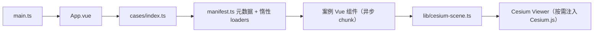

# 系统架构

## 概述

Cesium 酱の百宝箱是一个 Vue 3 单页案例中心。首页按分类筛选案例，打开案例后由对应 Vue 组件创建和销毁 Cesium Viewer。

## 技术栈

- TypeScript、Vue 3、Vite
- Cesium 1.144
- Element Plus

## 结构

```text
src/
├── main.ts              # Vue 应用入口
├── App.vue              # 案例列表和全屏容器
├── cases/               # 独立案例组件及注册元数据
└── lib/                 # Cesium 场景、影像和材质工具
```



## 加载策略

- `scripts/sync-cases.mjs` 自动扫描 `src/cases/` 生成 `manifest.ts`，首页仅加载元数据，案例组件为独立异步 chunk。
- Cesium.js 不再由首页 HTML 注入，首次悬停卡片或打开案例时按需加载（dev 为 `/cesium/Cesium.js` shim，build 为产物 `dist/cesium/`）。
- 首页加载体积与案例数量解耦。

## 新增模块

- `water-reflection`：Water 材质、水面边界、浮动物体和可切换倒影实体。
- `rectangle-depth-map`：世界地形、矩形拾取、地形采样、PNG 预览与基线 TIFF 导出。
