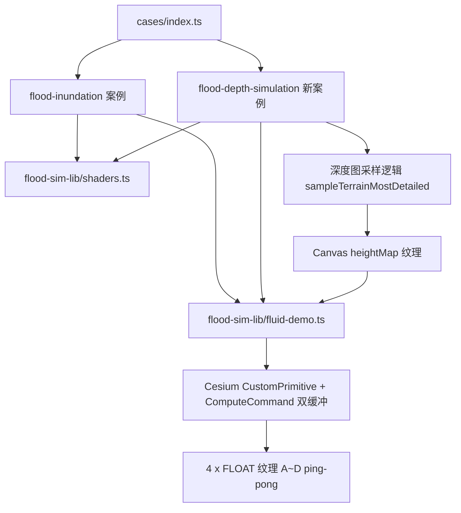

# 洪水模拟地形增强与深度图一体化案例

Feature Name: flood-terrain-simulation
Updated: 2026-08-31

## Description

本次迭代包含两项交付：

1. **需求A - 既有洪水模拟增加地形数据**：`flood-inundation` 案例场景初始化时与其他案例一致加载 Cesium World Terrain 全球地形与 Bing 影像，模拟盒体四至与真实地形区域重合，形成对照视图；模拟内核与固定深度图逻辑保持不变。
2. **需求B - 新增「深度图提取 + 洪水模拟」一体化案例**：用户输入四至或框选矩形范围 → `sampleTerrainMostDetailed` 采样真实地形 → 归一化生成深度图（预览 + 下载 + 直接作为模拟 heightMap）→ 点击地图选择出水点 → 启动 GPU 双缓冲流体模拟 → 支持流体参数/水闸/高程区间实时调节。

为满足「不回归」约束，将现有 `flood-inundation` 的 GPU 模拟内核（GLSL shader 常量、`CustomPrimitive`、`FluidDemo` 类、盒体矩阵/深度图归一化工具）抽取为公共库 `src/cases/flood-sim-lib/`，参数化四至与深度图数据源，两案例共同复用。

## Architecture

- 公共内核 `flood-sim-lib/` 只依赖 Cesium 标准 API（`ComputeCommand`/`DrawCommand`/`VertexArray.fromGeometry`/`ShaderProgram.fromCache`），与 Vue 无关，两案例均通过 uniformMap 闭包注入实时参数。
- `flood-depth-simulation` 的深度图生成流程复用 `rectangle-depth-map` 的成熟实现（四至输入/矩形框选/`sampleTerrainMostDetailed` 分批采样/PNG-TIFF 编码），但采样结果除预览与下载外，额外通过 Canvas 绘制为 `HTMLCanvasElement` 灰阶图，直接作为 `Cesium.Texture` 的 source 传给 `FluidDemo`，避免本地文件与静态 URL。

## Components and Interfaces

### 1. `src/cases/flood-sim-lib/shaders.ts`

从 `FloodInundationDemo.vue` 原样迁移（GLSL 300 es）：

- `COMMAND_SHADER`、`BUFFER_A_SHADER`、`BUFFER_B_SHADER`、`BUFFER_C_SHADER`、`BUFFER_D_SHADER`、`RENDER_SHADER`（含 `layout(location=0) out vec4 outputColor`、`texture()`、`in/out` 变量）。
- `getFullscreenQuad(): Geometry`：全屏四边形（position + st，索引 3 2 0 / 0 2 1）。
- `generateModelMatrix(position, rotation, scale): Matrix4`：ENU × RotX/Y/Z × Scale。
- `getDamPos(lon, lat, extent): Cartesian2`：四至归一化出水点/水闸坐标，`x=(lon-minLon)/(maxLon-minLon)`、`y=1-(lat-minLat)/(maxLat-minLat)`；`extent` 由调用方传入（替代原模块级 `EXTENT` 常量）。

### 2. `src/cases/flood-sim-lib/fluid-demo.ts`

- `type SimParams`（与现有一致）：waterAddRate/waterSourceRadius/attenuation/strenght/minTotalFlow/initialWaterLevel/depth/evaporationRate/waterAlpha/shallow/deep/minElevation/maxElevation/damHeight/setDam/waterSource/damStart/damEnd。
- `class CustomPrimitive`：原样迁移。
- `class FluidDemo`：构造签名从 `(viewer, options, image)` 扩展为 `(viewer, options, image, extent)`；`EXTENT` 常量改为构造参数；盒体尺寸（`EllipsoidGeodesic` 表面距离）、模型矩阵、`getDamPos` 均使用传入 `extent`。
- `type RenderContext = object`、`type FrameStateLike = { commandList: unknown[]; context: RenderContext }` 一并迁移。
- `destroy()`：移除 5 个 primitive + outlineOnly 实体 + 销毁全部纹理（含调用方传入的 heightMap，调用方销毁时无需重复销毁）。

### 3. 需求A 改造 `src/cases/flood-inundation/FloodInundationDemo.vue`

- `onMounted` 场景初始化改为：`createMapScene` → `loadBingImagery` → `loadWorldTerrain`（`statusMessage` 显示「正在加载Cesium World Terrain...」），失败 catch 降级继续；`viewer.scene.globe.depthTestAgainstTerrain = true` 保留。
- 相机飞行：先 `loadWorldTerrain` 完成后 `flyTo(EXTENT Rectangle)`。
- 删除文件内 shader 常量/`CustomPrimitive`/`FluidDemo`/`getFullscreenQuad`/`generateModelMatrix`/`getDamPos`，改为 `import { COMMAND_SHADER, ... } from '../flood-sim-lib/shaders'` 与 `import { FluidDemo, type SimParams } from '../flood-sim-lib/fluid-demo'`；`new FluidDemo(viewer, simParams, image, EXTENT)`。
- 其余交互（水源拾取/水闸/参数面板/重建）不变。

### 4. 新案例 `src/cases/flood-depth-simulation/`

- `index.ts`：id `flood-depth-simulation`，title「深度图洪水模拟」，category `water`，tag「流体模拟」，description 说明「手动框选或输入范围生成深度图，选择出水点执行 GPU 洪水模拟」。
- `FloodDepthSimulationDemo.vue`：
  - 场景：`createMapScene` + `loadBingImagery` + `loadWorldTerrain` + `depthTestAgainstTerrain = true`。
  - 范围输入面板：四至输入框（west/east/south/north，**默认空**，用户输入或框选后自动填充）+「按四至生成」「框选矩形范围」按钮 + 分辨率 select（128/256/512/1024，默认 256）。
  - 深度图生成：复用 `rectangle-depth-map` 的分批采样逻辑（`sampleTerrainMostDetailed`，rowsPerBatch 按 8192 点/批），完成后：
    - 生成预览 `ImageData` 灰阶图 → canvas → `toDataURL('image/png')` 供预览/下载。
    - 编码 TIFF Blob 供下载。
    - **同一灰阶 canvas 同时作为模拟 heightMap 纹理 source**（`Cesium.Texture`，`flipY:false`，LINEAR 采样）。
    - 记录采样统计（width×width、采样点数、min/max 高程）。
    - `SingleTileImageryProvider` 叠加显示采样范围（透明度可调）。
  - 模拟阶段：点击「开始模拟」→ 用已生成灰阶 canvas 构造 `Texture` → `new FluidDemo(viewer, simParams, canvas, extent)`；模拟面板（水源点/水闸/演进区域高程/流体参数/颜色）与 `flood-inundation` 一致，通过 uniformMap 实时联动。
  - 交互：LEFT_CLICK 选水源点（`scene.pickPosition` → 四至归一化 uv + 红点标记）；「绘制水闸」模式点击两点建墙；「重新生成深度图」先停止模拟再回到范围输入。
  - 拆分布局：右侧控制面板（范围+深度图生成 / 模拟控制）；左上深度图预览面板（仅生成后显示）。

## Data Models

- `DepthMapResult`：`{ width: number; heights: number[]; min: number; max: number; pngUrl: string; tiff: Blob; rectangle: Rectangle; canvas: HTMLCanvasElement }`（新增 `canvas` 字段供模拟复用）。
- 纹理流转：灰度 `ImageData`（0~255）→ `HTMLCanvasElement` → `Cesium.Texture`（RGBA/UNSIGNED_BYTE，`flipY:false`）→ compute shader `texture(heightMap, uv).r` 得 0~1 地形 → `terrainElevation = minElevation + r*(maxElevation-minElevation)` 由 uniform 决定。
- 四至归一化：出水点/水闸 `x=(lon-minLon)/(maxLon-minLon)`、`y=1-(lat-minLat)/(maxLat-minLat)`，与 `flood-inundation` 完全一致（v=0 顶=北，与纹理北向上自洽）。

## Correctness Properties

1. `flood-inundation` 重构前后行为一致：固定 EXTENT 与深度图不变，shader/双缓冲/交互参数不回归。
2. 深度图采样行列与纹理 UV 对齐：采样第 0 行对应最北（`north`），灰度 canvas 第 0 行写入该行数据，`flipY:false` 下 `uv.y=0`（gl_FragCoord 顶行）即最北——与 `getDamPos` 的纬度翻转一致。
3. 盒体四至 = 采样范围四至：`EllipsoidGeodesic` 计算的盒宽/盒高对应 `west↔east`、`south↔north` 表面距离，中心为 `Rectangle.center`。
4. 纹理生命周期：`FluidDemo.destroy()` 销毁 heightMap 与 4 张 FLOAT 纹理；重新生成深度图/重建模拟前先 destroy 旧 FluidDemo，避免重复创建 GPU 资源泄漏。
5. 最小/最大高程滑杆决定 `_relativeToZ` 与 `thickness`，与归一化深度图相乘得到实际地形高程；变更高程区间触发重建模拟（沿用现有 `onElevationChange` 逻辑）。

## Error Handling

- `sampleTerrainMostDetailed` 对 `EllipsoidTerrainProvider` 调用会抛错：`loadWorldTerrain` 成功后（`terrainReady` 标志）才允许生成深度图；未就绪时按钮禁用并提示「正在加载地形…」。
- 地形服务 503/502 间歇故障：`loadWorldTerrain` catch 后降级为椭球面继续；深度图生成阶段采样失败 catch 后 `statusMessage` 显示错误详情并允许重试。
- 四至输入非法（西≥东、南≥北、越界）：提示具体错误，不进入采样。
- SwiftShader 无头环境：模拟启动用状态读取验证（按钮变「停止模拟」、无 JS/GL 错误）；持续动画与真实地形对照以真实 GPU 浏览器验收。

## Test Strategy

1. `npm run build`（vue-tsc + vite）EXIT=0。
2. 无头 SwiftShader：
   - 首页「水面效果」分类 → 新案例卡片「深度图洪水模拟」打开 → 面板可见（范围输入 + 分辨率 select）。
   - 输入四至并点击「按四至生成」→ 状态文本显示采样进度/统计，深度图预览面板出现（读取 DOM 文本状态验证）。
   - 点击「开始模拟」→ 按钮变「停止模拟」且控制台无 JS/GL 错误。
   - 回归：`flood-inundation` 打开 → 「开始模拟」→ 状态正确、无 JS 错误（验证公共库抽取未破坏既有案例）。
3. 性能：4×1024×1024 RGBA32F compute + 光线步进在 SwiftShader 每帧 >100s 属预期，动画以真实 GPU 验收。

## References

[^1]: (Path) - [现有洪水模拟案例](src/cases/flood-inundation/FloodInundationDemo.vue)
[^2]: (Path) - [深度图提取案例](src/cases/rectangle-depth-map/RectangleDepthMapDemo.vue)
[^3]: (Path) - [案例注册表](src/cases/index.ts)
