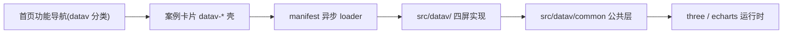
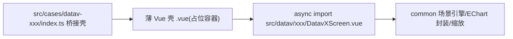

# datav-screen-module 可视化大屏模块 技术设计

Feature Name: 2026-09-08-datav-screen-module
Updated: 2026-09-08

## Description

在既有 Vue 3 + Cesium 案例中心中新增「可视化大屏」分类与 4 个独立大屏案例，参考 knight-L/sc-datav 的 4 个 demo 视觉，但按用户决策**不使用 React 双栈**：以原生 Three.js（命令式、非 R3F 声明式）重写 3D 场景，图表沿用项目已有 ECharts。大屏实现全部位于独立 `src/datav/` 子树，`src/cases/datav-*` 仅保留桥接壳做注册与懒加载。大屏进入后全屏呈现并按 1920×1080 设计稿等比缩放。

本设计解决三件事：
1. `src/datav/` 的目录结构与公共层（场景引擎、ECharts Vue 封装、等比缩放、动画与虚拟滚动等）如何搭建，供四屏复用。
2. 参考工程 R3F/React 声明式代码如何翻译为原生 Three.js 命令式代码的**映射规则**（含 drei/postprocessing/自研组件等价实现清单）。
3. 四屏各自的模块切分、素材清单、桥接注册方式与验收冒烟策略。

## Architecture

### 总体分层





关键约束：`src/cases/datav-*` 目录不含大屏实现代码；其 `index.ts` 的 `component` 指向壳内薄 Vue 组件，该组件再 `defineAsyncComponent` 引用 `src/datav/...`，保证 sync/懒加载机制不变且大屏代码独立于 src/cases 演进。

### 目录结构

```text
src/
├── cases/
│   ├── datav-demo0/           # 桥接壳（含薄壳 .vue）
│   ├── datav-demo1/
│   ├── datav-demo2/
│   ├── datav-demo3/
│   └── ...(既有案例不变)
└── datav/                     # 可视化大屏独立模块（不参与 sync 扫描）
    ├── common/                # 公共层（见下）
    ├── assets/                # 素材：四川 geo 数据、贴图、heatmapData、HDR、GLB
    └── demo0/ demo1/ demo2/ demo3/
```

## Components and Interfaces

### 公共层（src/datav/common）

| 模块 | 职责 | 对标参考工程 |
|---|---|---|
| `screenStage.ts` | 1920×1080 设计稿等比缩放（scale 到舞台容器并居中，容器尺寸变化时更新）；注册 rAF/清理 | autofit.js |
| `threeScreen.ts` | 命令式 Three.js 引擎：renderer/scene/camera/`OrbitControls`(examples)/fog/background；`mount(canvas/container)`/`useFrame(cb)`/`dispose()`/resize/WebGL 失败兜底错误提示 | `@react-three/fiber` Canvas + OrbitControls |
| `gridInfinite.ts` | drei Grid 无限网格 shader 等价物（GridHelper 不支持 fade/infinite，用自定义 ShaderMaterial 平面 + 网格着色） | drei Grid |
| `starsField.ts` | drei Stars 等价：THREE.Points + 顶点 shader 或 PointsMaterial 星空 | drei Stars |
| `echartBox.vue` | echarts init/resize(debounce)/setOption/replaceMerge:series/dispose，暴露 setOption | components/chart.tsx |
| `numberRoll.vue` | 数字滚动动画 | components/numberAnimation.tsx |
| `seamScroll.vue` | 无缝虚拟滚动表格 | components/seamVirtualScroll.tsx |
| `screenButton.vue` | 大屏按钮样式组件 | components/button.tsx |
| `heatCanvas.ts` | 热力数据 → 离屏 canvas（点集渐变），供贴图使用 | keli-heatmap.js |
| `hdrEnv.ts` | RGBELoader + PMREMGenerator 环境贴图（demo3），failover 兜底 | drei Environment/useEnvironment |
| `postFx.ts` | EffectComposer + UnrealBloomPass + 渲染目标 ToneMapping 组装（demo3） | @react-three/postprocessing |
| `panelShell.vue`/css | 大屏侧边面板框架样式 token | Demo 各 panel styled 布局 |

通用约定：所有 Vue 组件在 unmounted 时调用各资源 dispose；scene 组件提供显式 `init/destroy`；动画帧集中到一个共享 raf loop（screenStage 持有）。

### 桥接壳接口

`src/cases/datav-<demoN>/index.ts` 遵循既有 DemoCard 模板（id/title/category=`datav`/description/tag/component，不声明 icon）。薄 Vue 壳只渲染一个绝对定位容器，并在 onMounted 后 `defineAsyncComponent`/动态 import 真正大屏（或壳直接 import 自身子目录 `*.vue`，该子文件再 dynamic import `src/datav`）。使用 `src/datav/common` 保证大屏代码独立于案例目录。

## Data Models

- 案例注册数据：沿用 `DemoCard`（id 如 `datav-demo0`，category `datav`）。
- 分类项：`src/cases/index.ts` `categories` 追加 `{ id:'datav', label:'可视化大屏', icon: <Monitor 图标> }`。
- geo 数据：`sc.json`（四川 FeatureCollection，地市 polygon）与 `sc_outline.json`（轮廓），feature 结构原样迁移到 `src/datav/assets/`。
- heatmapData.json：FeatureCollection 点要素含 `value` 字段，迁移至 `src/datav/assets/`。
- 素材（png/jpg/hdr/glb/woff2 视需要）：按参考工程 `src/assets`、`public/hdr`、`public/model/glb`、`public/font` 原样复制，尺寸体积需收敛（Demo 公共 4.6MB 贴图；turbine.glb、hdr 单列评估）。

## 翻译映射规则（R3F → 原生 Three.js）

| 参考用法 | 等价原生实现 |
|---|---|
| `<Canvas>` + color attach background + fog | threeScreen.ts：Renderer + Scene.background/Scene.fog + 帧循环 |
| `<OrbitControls>`（enableZoom/rotate、polar/distance 参数） | `three/addons/controls/OrbitControls` 同名参数 + damping |
| R3F 组件树中每帧 useFrame 更新 | 命令式把更新函数注册进共享 raf 队列，闭包引用 mesh 对象 |
| 声明式 `<mesh><boxGeometry args/><meshBasicMaterial/></mesh>` | 命令式 `new Mesh(new BoxGeometry(...), new MeshBasicMaterial(...))` + scene.add |
| 组件卸载自动 dispose | destroy 阶段显式 traverse 释放 geometry/material/texture |
| drei Grid infiniteGrid | 自定义无限网格（ShaderMaterial，两个垂直平面网格线 + 衰减），参数对齐 cellSize/cellThickness/sectionSize/sectionColor/fadeDistance |
| drei Stars | 程序化星点 Points（随机球壳分布 + 大小衰减/闪烁由 material 透明度或 shader 承担） |
| drei Image（纹理弯曲卡片，Index 页 3D 轮播） | 场景外功能，不需移植 |
| drei Environment / useEnvironment(HDR) | RGBELoader→PMREMGenerator→scene.environment(+background)；HDR 为本地文件 |
| drei Stage（模型展台布光） | 手动等效：多个平行光 + 软阴影（demo3 不追求完全一致的 accumulative shadow，采用 ShadowMap PCFSoft 替代） |
| drei Loader | 自己实现加载提示层 |
| postprocessing Bloom/ToneMapping | EffectComposer(UnrealBloomPass) + 输出 sRGB/ACES ToneMapping 等效（或 renderer.toneMapping=ACESFilmic + Bloom） |
| drei Grid 地面 + 半透明层 | gridInfinite 地面置于 y=-1.4 等价 |
| styled-components | 统一 `.datav-screen` 作用域 + css 变量；每屏独立 class 前缀避免冲突 |
| zustand stores（Demo1/2 config） | Vue reactive store（模块内 composition，ref/reactive 或 defineStore 不引入 pinia，用模块级 reactive 单例） |
| 各屏自研 R3F 组件（shape/outline/flyLine/beam/cone/geoTrail/mirror/shaderMaterial…） | 逐屏拆为命令式「构建函数 + 帧更新函数」，见各屏章节 |

## Components（分屏设计）

### demo0 —— 三维四川地图大屏（轮廓/飞线/扫光/网格/星空）

- 场景：demo0/demo 主要容器为三维展示四川边界体（轮廓线条 + 地图挤出/顶面纹理）置于 3D 舞台，配网格与星空、轨道控制。
- 面板：`panel/` 4 张 ECharts 图（chart1..4）按布局栅格摆放，标题与数据字段对齐参考工程。
- Leva 实时调试条：参考工程 Leva（调背景色、网格显隐与颜色）。原生版本内置简化「设置条」或按参考默认值静态渲染（交互面板不作为验收硬指标，但保留等价微调入口更佳——以「调试浮条」折叠面板实现）。

### demo1 —— 数据大屏（柱条/热力/云雾/标签/图表面板）

- 三维四川地图：底图挤出 polygon（sc.json）→ map/base；城市数据（cityData.ts）柱状图 bar + 飞点 + 热点热力（heatmapData.json → heatCanvas 纹理投影）+ 云雾流动贴图 + 标签（Label/HTML overlay 评估用 sprite）+ tooltip 悬停。
- 面板 6 张 ECharts + header/footer + 指标数字滚动；顶部标题栏。
- 该屏代码量最大（参考约 2800 行），分文件平行移植，参考工程 map/index 装配顺序决定挂载时序；状态经 reactive config store 传递（侧栏联动）。

### demo2 —— 光束/锥体大屏

- 三维四川地图 + 动态效果组件（beamLight、cone 光束锥、geoTrail 流光拖尾、flyLine、boundary 动态轮廓、mirror 反射面或 shader 替代、label）；map/shaderMaterial 为自研着色器，需要逐字节比对 shader 源码迁移为 ShaderMaterial/GLSL。
- 面板 6 张 ECharts + header；布局含模拟镜面装饰。
- 风险点：shader 与 mirror 效果在原生 three 直接 ShaderMaterial 复刻，验收关注是否有渲染报错与观感接近。

### demo3 —— 风机 GLB HDR 展台

- 单屏无图表：加载 turbine.glb（GLTFLoader）→ PMREM HDR 环境 + Bloom + 无限网格地面 + 自动环绕（autoRotate）；右上角 Stats 用自定义帧率角标替代。
- 素材：`public/hdr/venice_sunset_1k.hdr`、`public/model/glb/turbine.glb`、字体 woff2（文字若使用则迁移）。
- demo3/model.tsx 的模型层级动画（旋转叶片等）需拆解其 useFrame 逻辑翻译。

## Correctness Properties

1. `src/cases/datav-*` 目录中不含 `src/datav` 之外的业务逻辑，`npm run sync` 后 4 壳在 manifest 自动注册，categories 含 datav。
2. `src/datav` 不在 `src/cases` 下，sync 不会把模块当案例；模块不 import 既有 Cesium lib。
3. 首页 HTML 不含大屏 chunk 引用；4 大屏为独立异步 chunk。
4. 卸载即清理：renderer 上下文、OrbitControls、effect composer、图表实例、帧循环全部释放；反复进出同案例不产生累计 GPU 资源。
5. 等比缩放以舞台容器 clientWidth/Height 为基准，比例 = min(w/1920, h/1080)，变换基于 transform-origin center。
6. 数据本地化：运行时无任何外网请求（无远程 geo/瓦片/字体/贴图/HDR/glb）。

## Error Handling

- WebGL 创建失败（renderer 不可用/上下文丢失）：展示「当前环境不支持 WebGL 大屏渲染」占位与重试按钮，不抛未捕获异常。
- 素材加载失败（GLB/HDR/图片/json）：展示局部加载状态文案并允许其余部分继续渲染；异步加载带超时与 then/catch 链，错误落 console.error 但不断言（冒烟脚本按 0 pageerror 过滤网络 404 场景需单独处理）。
- ECharts 容器尺寸为 0 时跳过 init/resize（防 echarts 告警）。
- 大屏缩放到极小舞台时保持可用（min scale 下限），避免 UI 溢出。

## Test Strategy

1. 静态校验：`npx vue-tsc -b --force`、`npm run build` EXIT=0；产物确认 4 个大屏各自独立 chunk、主入口不含 datav 代码。
2. 冒烟（Playwright headless SwiftShader）逐屏脚本：
   - 进入 `datav-*` 案例，等待 `.case-stage canvas` 存在；截图并统计非背景像素占比 > 阈值（证明场景渲染非黑屏）。
   - 0 console.error / 0 pageerror（网络 404 过滤规则与既有脚本一致）。
   - 缩放窗口大小后验证等比缩放宽度/高度比例正确。
   - 返回列表 → 再次进入同一大屏，验证无残留 canvas 与报错（资源释放）。
   - demo1/demo2 图表面板断言：各 ECharts canvas 存在且尺寸 > 0。
3. 功能等价抽查（与参考工程行为对照）：demo3 叶片旋转/自动环绕；demo2 shader 效果无渲染报错。
4. 数据无外网校验：进入各屏后断言无远程资源请求（仅本地域名请求）。

## Implementation Plan（建议顺序）

1. **P0 基建**：新增 three 依赖；`src/datav/common`（screenStage/threeScreen/echartBox 等）；categories 增加 datav；建 datav-demo0 壳跑通「壳 → async 大屏 → 全屏舞台」最小链路；Vite optimizeDeps 增 three。
2. **P1 样板屏 demo0**：完整移植一屏并冒烟，作为其余三屏模板（翻译模式/缩放/清理定型）。
3. **P2 demo1**（最大屏，含热力/柱条/云雾/6 面板，前端周期最长的交互迁移）。
4. **P3 demo2**（shader/光束/锥体/流光/mirror）。
5. **P4 demo3**（GLB+HDR+Bloom 展台）。
6. 各屏完成后执行整体回归（构建、逐屏冒烟、往返进入清理验证），更新 `docs/system-iteration-log.md` 与 `.monkeycode/docs`。

## References

[^1]: (GitHub) - [knight-L/sc-datav 仓库](https://github.com/knight-L/sc-datav)
[^2]: (README#L1) - 参考工程 README（技术栈与功能特性）
