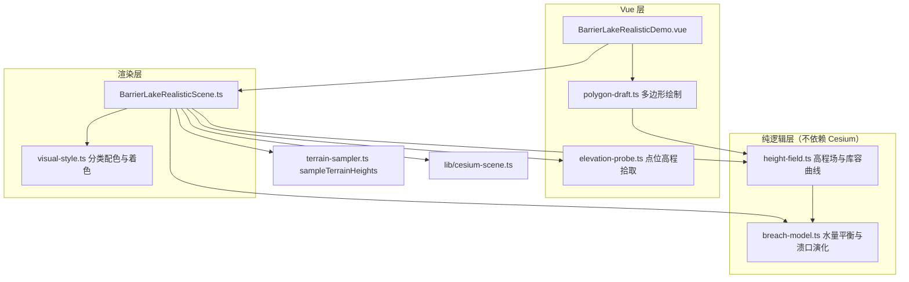

# 真实地形堰塞湖演化（barrier-lake-realistic）

Feature Name: barrier-lake-realistic
Updated: 2026-09-16

## Description

本设计交付一个替换 `barrier-lake-terrain` 的新案例。案例以白格滑坡所在的金沙江河谷为默认场景，从 Cesium World Terrain 采样真实高程构建地形，并以水量平衡物理模型驱动态演化：水位、出库流量、溃口尺寸与洪峰均由模型逐步计算得到，不再使用阶段参数插值。用户可以在地图上绘制多边形圈定任意河谷范围并重新运行。

## Architecture



分层原则：`height-field.ts` 与 `breach-model.ts` 只接收数值与数组，可在无 Cesium 环境下独立验证；`Scene` 负责把数值翻译为 Cesium 图元；`Demo` 只做控件与文本。

## Components and Interfaces

### height-field.ts

负责高程栅格的存储、插值、河道识别、多边形遮罩与库容曲线。

```ts
export interface HeightGrid {
  cols: number
  rows: number
  heights: Float32Array
  west: number
  east: number
  south: number
  north: number
  min: number
  max: number
}

export interface RiverAxis {
  centerLon: Float32Array
  bedH: Float32Array
  widthM: Float32Array
}

export interface PolygonMask {
  lon: Float32Array
  lat: Float32Array
  contains(lon: number, lat: number): boolean
}

export interface CapacityCurve {
  levels: Float32Array
  volumes: Float32Array
  levelAt(volume: number): number
  volumeAt(level: number): number
}

export function buildHeightGrid(raw: Float32Array, cols: number, rows: number, extent: ExtentDegrees): HeightGrid
export function fillMissing(grid: HeightGrid): number
export function heightAt(grid: HeightGrid, lon: number, lat: number): number
export function buildRiverAxis(grid: HeightGrid, widthThresholdM?: number, constraint?: PolygonMask): RiverAxis
export function buildPolygonMask(points: GeoPoint[]): PolygonMask
export function combineMasks(base: PolygonMask, overlay?: PolygonMask): PolygonMask
export function polygonCentroid(points: GeoPoint[]): GeoPoint | undefined
export function samplePointInPolygon(points: GeoPoint[], rng?: () => number): GeoPoint
export function boundsOfPoints(points: GeoPoint[]): ExtentDegrees
export function pickDamAxis(grid: HeightGrid, axis: RiverAxis, mask: PolygonMask): DamAxis
export function buildCapacityCurve(grid: HeightGrid, dam: DamAxis, mask: PolygonMask, samples: number): CapacityCurve
```

`heightAt` 使用双线性插值。`buildRiverAxis` 逐行取高程最低的列作为河道中心，并记录河床高程与该行的过水宽度；提供 `constraint` 时切换为严格模式，中心取该行遮罩跨度的中点、宽度取跨度全宽、河床取跨度内最低高程，遮罩外的行沿用最近有效行的中心与河床、宽度记 0，使河道严格贴合用户绘制的多边形。`combineMasks` 返回两个遮罩的交集。`polygonCentroid` 返回顶点平均位置。`samplePointInPolygon` 按扫描线求边与随机纬线的交点，在成对内部区间内按长度加权取点，对狭长与凹多边形都能均匀填充。`pickDamAxis` 在遮罩范围内寻找过水宽度最小的行作为坝址，跳过宽度为 0 的行以免落到自定义河道范围之外。`buildCapacityCurve` 将遮罩内、坝址上游、高程低于该水位的单元按 `(level - h) * cellArea` 累加，得到单调递增的库容曲线。

### breach-model.ts

负责水量平衡推进、堰流出流与溃口冲刷演化。

```ts
export interface BreachParams {
  inflow: number
  weirCoef: number
  initialWidth: number
  initialSill: number
  widthRate: number
  depthRate: number
  maxSillDrop: number
  maxWidth: number
}

export interface BreachState {
  time: number
  level: number
  storage: number
  breachWidth: number
  breachSill: number
  outflow: number
  peakOutflow: number
  peakTime: number
  released: number
  levelRate: number
}

export class BreachSimulator {
  constructor(curve: CapacityCurve, params: BreachParams, damCrest: number, initialLevel: number)
  step(dtSim: number): void
  state(): BreachState
  isStable(): boolean
  setInflow(q: number): void
}
```

单步推进逻辑：

1. 计算水头 `head = level - breachSill`；
2. 若 `head <= 0`，出库流量为零；否则按 `outflow = weirCoef * breachWidth * head^1.5` 计算；
3. 更新蓄量 `storage += (inflow - outflow) * dtSim`，并由库容曲线反演新的水位；
4. 冲刷强度按水头衰减 `intensity = clamp(head / 6, 0, 1)`，按 `widthRate * outflow^0.5 * intensity * dtSim` 增大溃口宽度（不超过 `maxWidth`），按 `depthRate * outflow^0.5 * intensity * dtSim` 降低溃口底高程（下切总量不超过 `maxSillDrop`），避免库水泄空后溃口仍持续展宽；
5. 记录峰值流量与累计下泄量。

内部按最大子步长切分 `dtSim`，保证单步水位变化不超过设定阈值。出库流量与水位变化率维护指数滑动平均，`isStable()` 依据滑动平均判定入库与出流是否平衡，避免空库附近的数值抖动被误判为不稳定。

### polygon-draft.ts

封装地图上的多边形绘制交互，不持有场景状态。

```ts
export interface PolygonDraftOptions {
  onVertex: (lon: number, lat: number, count: number) => void
  onFinish: (points: GeoPoint[]) => void
  onCancel: () => void
}

export class PolygonDraft {
  constructor(viewer: Viewer, options: PolygonDraftOptions)
  start(mode?: DraftMode): void
  cancel(): void
  dispose(): void
}
```

其中 `DraftMode = 'polygon' | 'point'`。交互约定：`polygon` 模式左键依次添加顶点，右键或双击结束，Esc 取消，绘制中显示顶点标记与折线，顶点数少于三个时结束视为取消；`point` 模式左键单击一次即结束，返回单个顶点。

### elevation-probe.ts

研究区点位高程拾取，不持有地形数据，采样逻辑由 `Scene` 注入。

```ts
export interface ElevationPoint {
  lon: number
  lat: number
  height: number
}

export interface ElevationProbeCallbacks {
  sample: (lon: number, lat: number) => Promise<number | undefined>
  onPoints?: (points: ElevationPoint[]) => void
  onModeChange?: (active: boolean) => void
}

export class ElevationProbe {
  constructor(viewer: Viewer, cb: ElevationProbeCallbacks)
  isActive(): boolean
  list(): ElevationPoint[]
  start(): void
  stop(): void
  clear(): void
  setLabelVisibility(value: number): void
  dispose(): void
}
```

交互约定：激活后左键点击地形采样该点高程，就地添加点位圆点与高程标注，可连续拾取；`clear()` 清除全部点位；`setLabelVisibility()` 使高程文字随视角距离淡出，圆点始终保留。同一画布上绘制模式与拾取模式互斥，`Scene.startDraw()` 会先停止拾取。

### BarrierLakeRealisticScene.ts

Cesium 编排层，持有 Viewer 与全部 Primitive，对外暴露与旧案例一致的控制接口。

```ts
export class BarrierLakeRealisticScene {
  constructor(container: HTMLElement, callbacks: SceneCallbacks, flashEl?: HTMLElement | null)
  gotoStep(index: number, instant?: boolean): void
  nextStep(): void
  prevStep(): void
  setPlaying(on: boolean): void
  reset(): void
  setLabels(on: boolean): void
  setSpin(on: boolean): void
  setRainManual(on: boolean): void
  setTerrainVisible(on: boolean): void
  setImageryVisible(on: boolean): void
  setInflow(q: number): void
  setDamHeight(h: number): void
  applyPolygon(points: GeoPoint[]): Promise<void>
  clearPolygon(): Promise<void>
  setViewPreset(id: number): void
  startDraw(): void
  cancelDraw(): void
  startElevationProbe(): void
  stopElevationProbe(): void
  clearElevationPoints(): void
  isElevationProbeActive(): boolean
  startFeatureDraw(kind: FeatureKind): void
  cancelFeatureDraw(): void
  clearFeature(kind: FeatureKind): void
  clearFeatures(): void
  setFeaturesVisible(on: boolean): void
  getFeatureState(): FeatureState
  getDiagnostics(): BreachState
  dispose(): void
}
```

标注可见性：`applyLabels()` 每帧读取相机高度，在 `LABEL_NEAR_HEIGHT(12000 m)` 以下标注全显示，`LABEL_FAR_HEIGHT(22000 m)` 以上全部隐藏，中间按高度线性淡出；高程点位文字复用同一可见度，圆点不受影响。阈值取该量级以保证默认全景视角（相机高度约 10 km）仍完整显示标注。

要素绘制：`FeatureKind` 为 `valley | channel | upstream | downstream | source`，`FEATURE_DEFS` 声明各类要素的名称、绘制模式、配色与透明度（上游/下游为 `point`，其余为 `polygon`）。`deriveScene()` 统一派生河道轴、坝址与库容曲线：河道面作为 `buildRiverAxis` 的 `constraint`（严格跟随绘制范围），河谷面与研究区范围经 `combineMasks` 得到 `waterMask` 并用于水面渲染与 `buildCapacityCurve`，上游/下游点按行序覆盖 `dam.upDir`，未绘制的要素沿用自动判定。滑坡源区面经 `samplePointInPolygon` 采样起滑点，碎屑初始进度为 0 且贴近面内地表，保证生成瞬间铺满绘制范围。`refreshAfterFeatures()` 在要素变化后重算派生结果、重建地形/坝体/碎屑/水面图元并重置模拟器。`rebuildFeatureEntities()` 以半透明贴地多边形渲染面要素、以圆点加名称渲染点要素。

### BarrierLakeRealisticDemo.vue

控件与讲解层：阶段条、播放控制、参数输入、多边形绘制入口、点位高程拾取入口、诊断面板、科普弹窗、图例与视角预设。诊断面板按帧读取实时物理量展示水位、蓄量、溃口宽度与底高、下泄流量与洪峰；点位高程面板列出每个拾取点的经纬度与高程，并汇总最高、最低高程。

## Data Models

### 默认场景参数

| 参数 | 取值 | 依据 |
|---|---|---|
| 默认范围 | `98.660~98.760E, 31.020~31.120N` | 覆盖白格滑坡与上下游河谷 |
| 采样网格 | `240 × 180` | 兼顾细节与 43200 点的采样量 |
| 滑坡范围 | `98.69806~98.73083E, 31.07111~31.09111N` | 白格滑坡实测空间范围 |
| 堰塞体坐标 | `31.0819N, 98.69767E` | 白格堰塞体实测坐标 |
| 河床高程 | 约 `2870 m` | 白格事件实测 |
| 初始水位 | 约 `2875 m` | 白格事件实测江水位 |
| 坝高 | 第一次 `61 m`，第二次 `96 m` | 两次最低堰顶高度 |
| 入库流量 | `1200 m³/s` | 金沙江该河段枯期量级 |
| 堰流系数 | `1.6` | 宽顶堰经验取值 |
| 溃口初始宽度 | `20 m` | 初始过流缺口 |
| 库容曲线采样 | `160` 个水位分档 | 平衡精度与预计算耗时 |

### 阶段与物理状态映射

| 阶段 | 物理状态 |
|---|---|
| 深切河谷 | 无坝，水位等于河床高程 |
| 触发震动 | 无坝，呈现降雨与地震表现 |
| 山体失稳 | 滑坡体下滑，坝体几何由下滑进度驱动 |
| 堵塞成坝 | 坝体成形，初始化库容曲线与溃口参数 |
| 蓄水成湖 | 水量平衡推进，出流为零，水位上涨 |
| 漫顶溢流 | 水位达到垭口高程，堰流开始过流，溃口启动冲刷 |
| 溃坝洪峰 | 溃口快速展宽下切，出流急增，水位骤降 |
| 稳湖留存 | 出流回落至入库流量附近，溃口停止发展 |

阶段跳转不再插值参数，而是把模拟器重置到对应阶段的初始状态：成坝之前由几何进度决定，成坝之后由模拟器状态决定。

## Correctness Properties

1. 库容曲线满足单调性：任意 `a < b` 有 `volumeAt(a) <= volumeAt(b)`。
2. 库容反演自洽：`levelAt(volumeAt(l))` 与 `l` 的偏差不超过分档间距。
3. 出流为零条件：当水位不高于溃口底高程时，`outflow` 等于零。
4. 溃口尺寸单调：`breachWidth` 与溃口下切量随模拟时间不减。
5. 水量守恒：`storage(t) - storage(0)` 与 `∫(inflow - outflow)dt` 的相对偏差不超过百分之一。
6. 稳定判据：`|outflow - inflow| / inflow` 小于百分之五且水位变化率低于阈值时判定为稳定。
7. 多边形遮罩：遮罩外的单元对库容的贡献为零。
8. 几何有效性：球面多边形面积大于设定下限才接受为模拟范围。

## Error Handling

| 场景 | 处理 |
|---|---|
| 地形采样失败 | 提示失败原因，保留默认场景并允许重试 |
| 采样点高程缺失 | 邻域有效值多轮填补，仍缺失则用区域均值 |
| 多边形顶点少于三个 | 放弃该次绘制，保留原范围 |
| 多边形面积过小或退化 | 拒绝应用并提示原因 |
| 采样格点超过上限 | 按下限约束自动降低列行数，保持长宽比 |
| 库容曲线为空或全零 | 终止演化并提示坝址处无可蓄水地形 |
| 数值发散或水位越界 | 中断推进，回退到上一稳定状态并提示 |

## Test Strategy

项目未引入测试框架，验证按以下层次进行：

1. 类型与构建验证：执行 `npm run build`，由 `vue-tsc` 校验类型，`vite build` 校验打包。
2. 纯逻辑自检：在开发期临时以 Node 脚本驱动 `height-field.ts` 与 `breach-model.ts`，断言上述正确性属性，验证后移除脚本。
3. 同步验证：执行 `npm run sync`，确认 `manifest.ts` 中旧案例条目消失、新案例条目出现且 `icon` 为空。
4. 视觉与交互验证：启动 `npm run dev`，分别验证默认场景开箱即用、多边形绘制、阶段跳转、参数调整与资源释放。

## Migration

1. 删除目录 `src/cases/barrier-lake-terrain/`。
2. 执行 `npm run sync` 重新生成 `manifest.ts`。
3. 新增目录 `src/cases/barrier-lake-realistic/` 并编写上述模块。
4. 再次执行 `npm run sync` 完成注册。
5. 执行 `npm run build` 确认无残留引用。

## References

[^1]: 环境工程技术学报 - 白格滑坡空间范围、高差与两次堰塞坝高度数据
[^2]: 中国气象数据网 - 白格堰塞湖 2018 年水位、堰塞体规模与贯通时间
[^3]: 水文地质工程地质 - 白格滑坡溃决峰值流量模拟结果
[^4]: `src/cases/barrier-lake-terrain/BarrierLakeTerrainScene.ts` - 可复用的真实地形采样、双线性插值与网格 Primitive 构建方式
[^5]: `src/cases/water-depth-extraction/terrain-sampler.ts` - `sampleTerrainHeights` 采样接口
[^6]: `scripts/sync-cases.mjs` - 案例自动注册机制与 icon 可选约定
