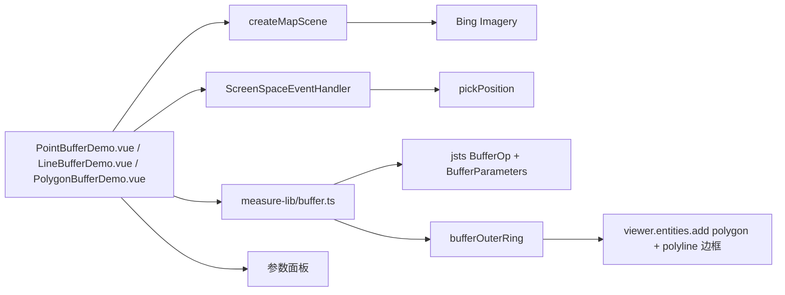

# 缓冲区分析三案例

Feature Name: buffer-analysis
Updated: 2026-08-26

## Description

三个独立 Vue 案例：点/线/面缓冲区分析。数据源由地图点击拾取或坐标输入创建，经 turf.js 按缓冲值（米）生成 GeoJSON 缓冲区多边形，再转换为 Cesium polygon 实体渲染，支持圆角/方角等缓冲参数与显示样式实时联动。

## Architecture

## Components and Interfaces

- `src/cases/measure-lib/buffer.ts`：共享缓冲区计算库。
  - `pointBuffer(lng, lat, params)` / `lineBuffer(lngLats, params)` / `polygonBuffer(lngLats, params)`：返回 turf Polygon 或 null。
  - `BufferParams = { radius, joinStyle, endCapStyle, steps }`。
  - 基于完整版 `jsts`（2.7.1）`BufferOp(geom, BufferParameters)`：`setJoinStyle`（round/miter/bevel）、`setEndCapStyle`（round/flat/square）、`setQuadrantSegments`（steps 圆滑度）。
  - 投影复用 turf 方位等距投影方案（`geoAzimuthalEquidistant().rotate(...).scale(earthRadius)`）。
  - `polygonBuffer` 自动闭合环（`closeRing`），满足 JTS 对 ring ≥4 点的约束。
  - `bufferOuterRing(poly)` 取外环 `Position[]`。
  - jsts 为 CJS 且自带 `__esModule: true`，通过 `import * as jstsModule` + `operation` 存在性判断兼容 vite dev/build。
- `src/cases/point-buffer/PointBufferDemo.vue`：坐标输入或地图点击创建点，生成圆缓冲；参数：半径、圆滑度、填充/透明度、边框开关/颜色/宽度。
- `src/cases/line-buffer/LineBufferDemo.vue`：动态绘制折线（顶点 + 预览线），结束后生成缓冲；参数：缓冲值、端点样式、拐角样式、圆滑度、填充/边框。
- `src/cases/polygon-buffer/PolygonBufferDemo.vue`：动态绘制面（顶点 + 预览边框），闭合后生成缓冲；源面为黄色半透明填充 + 黄色轮廓线；参数同线缓冲案例。
- 缓冲边框使用独立 `polyline` 实体（Cesium polygon outline 渲染不可靠），开关/颜色/宽度直接作用于 polyline。
- 各案例 `index.ts`：分类 `analysis`（空间分析），`icon` 引用用户提供截图（image-1/2/3）。
- 绘制交互（线/面）：`LEFT_CLICK` 采集顶点，`RIGHT_CLICK` 或 `LEFT_DOUBLE_CLICK` 结束/闭合。

## Correctness Properties

- 点缓冲经 `Cartographic.fromCartesian` 转换点击位置为经纬度后计算。
- 线/面缓冲参数（缓冲值、端点/拐角样式、圆滑度）变更时遍历已绘要素重算 `hierarchy`。
- 显示样式（填充/透明度/边框）变更仅更新材质与边框属性，不重算几何。
- 面缓冲在顶点为 3 个时也能正确生成（自动闭合环）。
- 案例卸载后销毁 handler 与 Viewer，`disposed` 保护避免写入已销毁 Viewer。

## Error Handling

地图加载失败时显示错误信息；缓冲区生成失败（返回 null）时提示"缓冲区生成失败，请检查缓冲值"；经纬度输入越界时提示有效范围。

## Test Strategy

- 使用 `npm run build` 验证 TypeScript、Vue 模板和 Vite 构建。
- 无头浏览器逐案例验证：点案例坐标创建与地图点击生成缓冲、半径变更；线案例绘制结束生成 1 线 + 1 缓冲、拐角样式切换不崩溃；面案例 3 点闭合生成 1 面 + 1 缓冲、缓冲值变更重算；全程零 pageerror。

## References

- Cesium `Entity.polygon`、`PolygonHierarchy`、`PointPrimitiveCollection`、`PolylineCollection` 文档。
- Turf.js `@turf/buffer`（`joinStyle`/`endCapStyle`/`steps` 参数）与 `@turf/helpers`。
