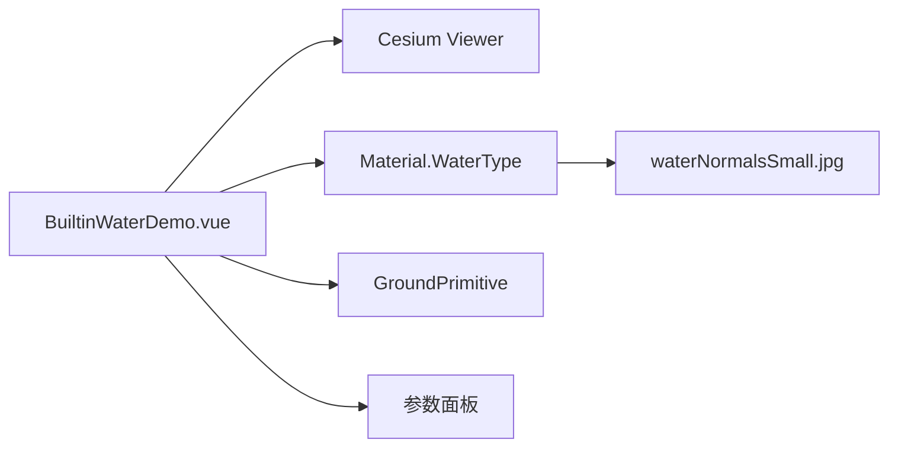

# Cesium 内置动态水面

Feature Name: builtin-water
Updated: 2026-08-23

## Description

案例使用 Cesium `Material` 的 `fabric.type = 'Water'` 创建内置 Water 材质，并通过 `GroundPrimitive`、`GeometryInstance` 和 `EllipsoidSurfaceAppearance` 生成贴地水面。参数面板提供显隐、频率、动画速度、波幅、颜色和边界控制。

## Architecture

## Components and Interfaces

- `src/cases/builtin-water/BuiltinWaterDemo.vue`：Viewer、GroundPrimitive、Water 材质、参数和边界控制。
- `src/cases/builtin-water/index.ts`：案例元数据。
- `src/cases/builtin-water/waterNormalsSmall.jpg`：用户上传的水面法线纹理。

## Correctness Properties

- 水面图元显隐状态与效果开关一致。
- 参数变化只更新 Water 材质 uniform，不重建 Viewer。
- 边界更新后水面图元仍使用同一材质实例。
- 案例卸载后 Viewer 和水面图元均释放。

## Error Handling

边界点少于三个或坐标无效时，案例显示边界校验错误并保留当前水面。

## Test Strategy

- 使用 `npm run build` 验证 Cesium Water 类型、资源导入和 Vue 模板。
- 浏览器中检查法线纹理、参数实时变化、显隐切换和边界更新。
