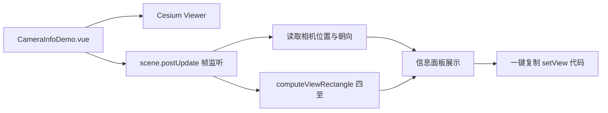

# 相机参数案例

Feature Name: camera-info
Updated: 2026-08-23

## Description

新增独立 Vue 案例组件，实时读取 Cesium Viewer 的相机状态：经度、纬度、海拔、航向角、俯仰角、翻滚角，以及当前视口在地表投影的四至坐标。提供一键复制功能，生成可直接执行的 `viewer.camera.setView({...})` 代码片段，方便在其他工程恢复相同视角。

## Architecture



## Components and Interfaces

- `src/cases/camera-info/CameraInfoDemo.vue`：Viewer 生命周期、帧监听、信息面板与剪贴板操作。
- `src/cases/camera-info/index.ts`：案例元数据。
- `src/cases/camera-info/icon.webp`：案例卡片图标。
- 复用 `src/lib/cesium-scene.ts` 的 `createMapScene`、`destroyScene`、`loadBingImagery`。

### 数据模型

- 相机位置：`positionCartographic` 转 `Cartographic`，经纬度以十进制度展示，海拔以米展示。
- 相机朝向：`camera.heading`、`camera.pitch`、`camera.roll`，弧度转十进制度展示。
- 四至坐标：`camera.computeViewRectangle()`，缺省椭球参数；视口未覆盖椭球时返回 `undefined`。
- 复制内容同时包含相机位置、朝向注释与四至坐标注释，以及可回放代码片段：

```javascript
// 相机位置（十进制度）
// longitude: 116.394321, latitude: 39.915553, height: 4500
// 当前视口四至（十进制度）
// west: 116.326123, south: 39.903987, east: 116.463876, north: 39.931234
viewer.camera.setView({
  destination: Cesium.Cartesian3.fromDegrees(116.394321, 39.915553, 4500),
  orientation: {
    heading: Cesium.Math.toRadians(0),
    pitch: Cesium.Math.toRadians(-90),
    roll: 0
  }
})
```

## Correctness Properties

- 帧监听注册后，每次相机变化都刷新面板数值。
- `computeViewRectangle` 返回 `undefined` 时，四至区域显示占位文本。
- 组件卸载后移除 `postUpdate` 监听并销毁 Viewer。
- 面板经纬度与复制内容均使用十进制度，`fromDegrees` 参数为十进制度。
- 复制代码中的角度均使用弧度值，并引用 `Cesium.Math.toRadians` 以保持可读性。

## Error Handling

- 视口未覆盖椭球时，四至显示"当前视角无有效地表范围"。
- 剪贴板写入失败时，面板显示复制失败提示。

## Test Strategy

- 使用 `npm run build` 验证 TypeScript、Vue 模板和 Vite 构建。
- 在浏览器预览中拖动视角，检查四至、相机位置和朝向实时更新。
- 点击复制按钮，粘贴内容校验代码片段格式。
