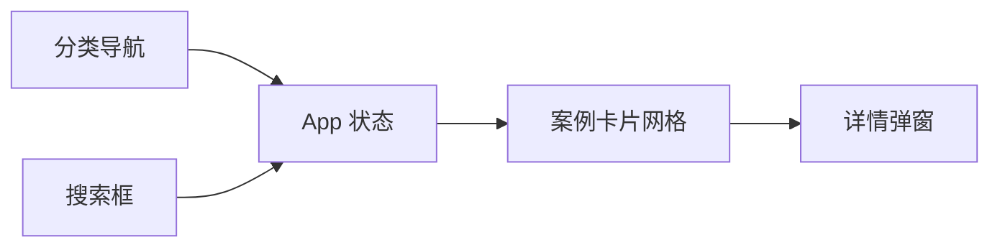

# Cesium 案例展示界面

Feature Name: cesium-case-gallery
Updated: 2026-08-21

## Description

构建一个基于 Vue 3、Vite、TypeScript 和 Element Plus 的 Cesium 功能案例展示界面，提供分类浏览、案例搜索、响应式卡片网格和详情弹窗。

## Architecture

页面采用单组件展示层，案例分类与卡片数据在组件内以类型约束的静态数据提供。`activeCategory`、`searchTerm` 和 `selectedDemo` 共同驱动视图状态。

## Components and Interfaces

- `App.vue`：页面布局、分类导航、案例筛选、卡片展示和详情弹窗。
- `Category`：描述分类标识、名称、数量和 Element Plus 图标。
- `DemoCard`：描述案例标题、分类、说明、标签和缩略图主题。
- `style.css`：提供主题视觉、CSS 场景缩略图和桌面/平板/移动端断点。

## Correctness Properties

- 当前展示的每张卡片都属于当前选中分类。
- 搜索关键词变化后，卡片集合仅包含名称匹配项。
- 移动导航关闭后，内容区保持当前分类状态。

## Error Handling

当搜索结果为空时，系统显示空状态提示，并保留当前分类和搜索条件供用户调整。

## Test Strategy

- 使用 `npm run build` 验证 TypeScript 类型和 Vite 生产构建。
- 在桌面、平板和移动宽度下检查导航、网格列数、搜索和弹窗交互。
