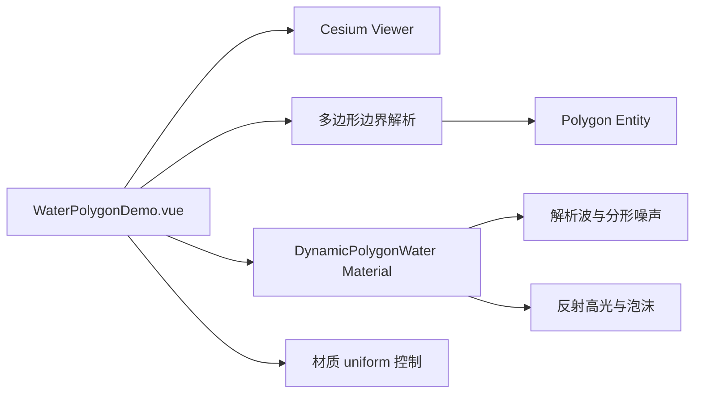

# 动态多边形水面案例

Feature Name: dynamic-polygon-water
Updated: 2026-08-23

## Description

新增独立 Vue 案例组件，使用 Cesium `Material` Fabric 将 Shadertoy `csc3RS` 的动态水面视觉思路适配为多边形材质。原始 shader 的 Buffer A/B/C 提供浅水方程的速度和水高反馈；案例使用解析波和分形噪声生成连续法线，保留 Image 阶段的反射、折射色彩、高光和泡沫表现。

## Architecture

## Components and Interfaces

- `src/cases/water-polygon/WaterPolygonDemo.vue`：Viewer 生命周期、边界输入校验、多边形实体、动画时间和参数面板。
- `src/cases/water-polygon/index.ts`：案例元数据。
- `src/lib/water.ts`：注册 `DynamicPolygonWater` Fabric 材质并提供 GLSL 源码。
- `src/cases/water-polygon/DynamicWaterMaterialProperty.ts`：将动态 uniforms 作为 Cesium `MaterialProperty` 返回值，避免每帧重建 `Material` 实例。
- 材质 uniforms：`time`、`waveSpeed`、`waveScale`、`waveHeight`、`clarity`。
- 边界输入格式：`longitude,latitude;longitude,latitude;longitude,latitude`。

## Correctness Properties

- 边界坐标数量大于等于三个时才更新实体层级。
- 每个边界坐标的经度和纬度均为有限数值。
- 开关只改变水面实体可见性，保留已输入的边界和材质参数。
- 案例卸载后不存在继续更新材质时间 uniform 的帧监听器。
- Fabric 材质在创建多边形 Entity 前完成幂等注册。

## Error Handling

边界输入不满足格式时，控制面板显示坐标格式说明；Viewer 或影像初始化异常时，案例显示状态面板。

## Test Strategy

- 使用 `npm run build` 验证 TypeScript、Vue 模板和 Vite 构建。
- 通过开发服务器请求案例模块，确认 HMR 响应正常。
- 在浏览器预览中检查水面动画、参数滑杆、开关和边界输入更新。

## References

- [Shadertoy csc3RS](https://www.shadertoy.com/view/csc3RS)
- [上传的 WaterPolygonDemo 参考组件](../../.monkeycode-tmp-files/384b9fdd-WaterPolygonDemo-2.vue)
- [上传的动态水面 shader](../../.monkeycode-tmp-files/8ecc7320-water-3.ts)
- [上传的 DynamicWaterMaterialProperty](../../.monkeycode-tmp-files/45bd9e2c-DynamicWaterMaterialProperty-4.ts)
