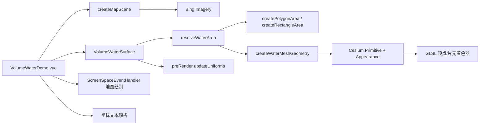

# 动态体积水案例

Feature Name: dynamic-volume-water
Updated: 2026-08-26

## Description

指定多边形/矩形构建真实几何起伏的动态体积水面。水面由自定义 `Cesium.Primitive`（程序化网格 + 自定义 GLSL 顶点/片元着色器）渲染：顶点着色器基于分形噪声做几何位移并生成切空间扰动法线，片元着色器合成泡沫、菲涅尔天空反射、太阳高光与深浅水色。支持地图绘制/坐标文本指定多边形，并提供运动/外观/范围三组参数实时调节。

## Architecture

## Components and Interfaces

- `src/cases/dynamic-volume-water/VolumeWaterSurface.ts`：
  - `VolumeWaterSurface` 类：封装 Primitive 生命周期（`addToScene`/`rebuild`/`updateUniforms`/`updatePosition`/`setPolygon`/`setRectangle`/`flyTo`/`destroy`）。
  - `WATER_RANGE_MODES`（rectangle/polygon）、`WaterParams`（动画、运动、外观、范围、颜色、网格分段）、`WaterRangeMode`、`PolygonPosition`。
  - `resolveWaterArea`：多边形模式取顶点质心建 ENU frame，顶点转局部 XY 平面；矩形模式以中心经纬度/宽深建 frame。
  - `createWaterMeshGeometry`：`meshSegments`→xSegments（≥8），ySegments 按 depth/width 比例；多边形模式用 `isPointInPolygon` + `shouldKeepPolygonVertex`（含半格采样）裁剪边界格点；生成 position(Float64)/normal/tangent/bitangent/st/batchId 与索引（>65535 用 Uint32）。
  - GLSL 顶点着色器：5 层 `vertexSeaHeight` fBm（freq 0.16×1.9、amp ×0.22、choppy mix），`st`→centered uv，±eps 有限差分法线，`normal * displacement`（`u_vertexGeometryWaveHeight`）几何位移，`czm_computePosition()`/`czm_modelViewRelativeToEye`/`czm_normal` 输出 `v_*EC`。
  - GLSL 片元着色器：6 层 `seaHeight` fBm，`waterNormal` 切空间法线→EC 重建，crest 泡沫（高度 smoothstep + 斜率），fresnel 天空反射，`czm_sunDirectionEC` diffuse/sparkle/slopeGlint，`czm_gammaCorrect` 输出 `out_FragColor`。
  - **关键约定**：`new Cesium.Appearance({ ... })` 必须传 `material: Cesium.Material.fromType(Cesium.Material.ColorType)`，否则 `Appearance.update()` 返回 falsy 且 Primitive 不生成渲染命令。
- `src/cases/dynamic-volume-water/VolumeWaterDemo.vue`：
  - 面板分组：波浪动画开关 / 运动参数（时间缩放、流速、波密度、波高、几何高度、Choppy）/ 外观参数（泡沫、法线强度、菲涅尔、高光、透明度、深/浅/泡沫色）/ 范围（模式、网格分段、矩形尺寸/中心/高度、多边形坐标与绘制）。
  - 运动/外观参数 `watch` 实时 `updateUniforms()`；网格分段、矩形宽深 `@change` 重建 + flyTo；高度/中心 `@change` 仅 `updatePosition()`；模式切换 `applyRangeMode()`。
  - 多边形指定：`parsePolygonText` 解析坐标文本（`经度,纬度;...`）；地图绘制 `LEFT_CLICK` 采集（350ms 内近距点击防抖）、`RIGHT_CLICK`/`LEFT_DOUBLE_CLICK` 结束，`PointPrimitiveCollection` + `PolylineCollection` 预览；**`finishPolygon` 将 `Cartographic.fromCartesian` 的弧度值 `×180/π` 转为度数**后 `toFixed(5)` 写入坐标文本与 `setPolygon`。
  - 默认多边形：`DEFAULT_POLYGON_TEXT` 由 `LIJIANG_WATER_POSITIONS`（丽江水域，428 点）生成，坐标文本框初始即丽江边界。
  - 面板精简：不提供「重置默认多边形」「重建水面」「复位视角」按钮；`applyAreaRebuild` 保留供网格分段/矩形宽深滑块复用（重建 + flyTo）。
  - 默认加载 Cesium World Terrain：`depthTestAgainstTerrain = true`、`maximumScreenSpaceError = 2`，`statusMessage` 显示「正在加载Cesium World Terrain...」；`loadWorldTerrain(viewer)` 成功/失败均调用 `initWaterScene()`（失败降级仍渲染水面）；`disposed` 标志保护异步回调不写已销毁 Viewer。
  - 默认参数适配丽江：`planeHeight=2400`（丽江水域海拔）、`planeLon/planeLat=100.66/26.55`，矩形模式滑块范围 99~102 / 25~28。
- `src/cases/dynamic-volume-water/index.ts`：`effects` 三维特效分类，标题「水面效果-动态体积水」，tag「材质效果」，无 icon（暂无截图占位）。

## Correctness Properties

- 网格顶点数 = 多边形内及半格邻近格点，按 `containsPoint` 判定；相邻四格任一缺失则跳过该三角片（避免跨越空洞）。
- 波浪 uniform 前缀约定：顶点 `u_vertex*`、片元 `u_*`；`updateUniforms` 同步设置（含 `u_time`↔`u_vertexTime`）。
- 多边形顶点自动归一化（去首尾重复、过滤非法数值），<3 点时回退矩形模式。
- 相机 flyTo 以面积中心 ENU frame 相对偏移（`-w*0.42, -d*0.56, geometryWaveHeight*3.2`），heading 42° / pitch -18°。
- 案例卸载：销毁 ScreenSpaceEventHandler、`surface.destroy()`（移除 preRender 监听与 Primitive）、`destroyScene(viewer)`。

## Error Handling

- 坐标文本格式错误/顶点不足：`result-hint` 提示，不重建。
- 绘制结束顶点 <3：清空预览并提示"点数不足，至少需要 3 个点"。
- 地图初始化失败：`status-mask` 显示错误信息。
- 无头 swiftshader 下 `pickPosition` 偶发 null（渲染时序）可能丢顶点，真实 GPU 环境正常。

## Verification Plan

- `npm run build`（vue-tsc + vite）通过。
- 无头浏览器（Playwright + swiftshader）：
  - 进入案例零 pageerror/console error。
  - CDP 截图（pngjs 统计）确认水面渲染：默认多边形蓝色像素占比 >20%，切换矩形、应用自定义多边形后均有水面像素。
  - 坐标文本应用后 `result-hint` 显示"已应用多边形水面（N 个顶点）"。
