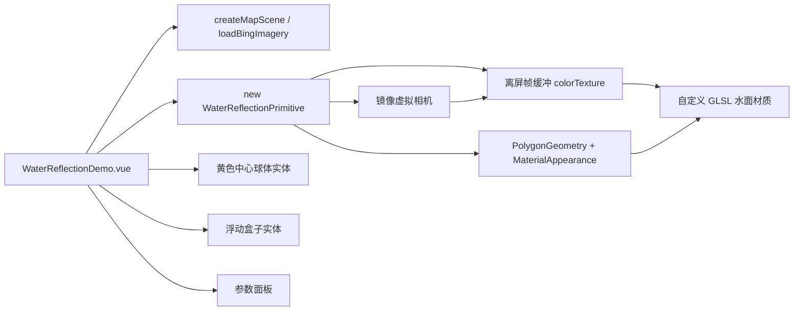

# 动态水面-Primitive 真实倒影移植

Feature Name: dynamic-water-reflection
Updated: 2026-08-25

## Description

将 Arc3DLab-SDK-Pro 参考项目的"动态水面（带倒影）"案例移植到当前 Cesium 案例中心。核心是 `WaterPrimitive`：以镜像虚拟相机将场景渲染至离屏帧缓冲生成反射纹理，再由自定义 GLSL 水面材质按法线扰动采样该纹理，实现波纹、反射、光照、高光等效果。案例完全复刻参考 demo 011 的丽江水域场景、黄色中心球体、浮动盒子与全量参数面板，适配 Cesium 1.144 与项目公共场景生命周期。

## Architecture

渲染流程：`WaterReflectionPrimitive.preRender` 每帧执行 `updateVirtualCamera` 计算镜像相机，切换主相机后手动渲染场景（`updateFrameState` + `updateAndExecuteCommands` + `resolveFramebuffers`）至离屏帧缓冲，再以 `Texture.fromFramebuffer` 生成的纹理更新材质 `image` uniform。

## Components and Interfaces

### `src/cases/water-reflection/WaterReflectionPrimitive.ts`

从参考 `WaterPrimitive.ts` 移植的 Primitive 类，导出 `WaterReflectionOption` 接口与默认实现：

- 接口字段：`height`、`flowDegrees`、`positions: Cartographic[]`、`normalMapUrl`、`rippleSize`、`waterAlpha`、`waterColor`、`reflectivity`、`lightDirection`、`sunShiny`、`distortionScale`。
- 可变属性 getter/setter：`rippleSize`、`waterAlpha`、`reflectivity`、`distortionScale`、`height`、`sunShiny`、`lightDirection`、`waterColor`。
- `destroy()`：移除 `preRender` 监听、从 `scene.primitives` 移除图元、销毁帧缓冲与纹理。

### `src/cases/water-reflection/WaterReflectionDemo.vue`

Vue 组件：创建公共场景、加载 Bing 影像与 Cesium World Terrain 地形、实例化水面 Primitive、创建中心球体与浮动盒子、绑定 `scene.preUpdate` 驱动盒子运动与朝向、提供全量参数面板、卸载时销毁。

### `src/cases/water-reflection/index.ts`

注册 `DemoCard`：id `water-reflection`、title `水面效果-Primitive真实倒影`、category `effects`、本地 `icon.webp`。

### 资源

- `src/cases/water-reflection/water-img.ts`：从参考项目复制的 base64 水面法线纹理。
- `src/cases/water-reflection/icon.webp`：本地案例图标（用户提供的 image-1）。
- 丽江水域坐标数组内联于 `WaterReflectionDemo.vue`。

### 注册

`src/cases/index.ts` 导入并加入 `demos` 数组。

## Data Models

- `positions: Cartographic[]`：参考 demo 011 的丽江水域轮廓（约 420 个经纬度点），高度取 `1480 + 5 * Math.random()`，`perPositionHeight: true`。
- 帧缓冲：`colorTexture`（RGBA，hdr 时 HALF_FLOAT/FLOAT，否则 UNSIGNED_BYTE）+ `depthTexture`（`DEPTH_COMPONENT` + `UNSIGNED_INT`），`destroyAttachments: false`。
- 材质 uniforms：`size`、`waterColor`、`waterAlpha`、`rf0`、`lightDirection`、`sunShiny`、`distortionScale`、`normalTexture`、`image`、`time`、`fixedFrameToEnu`。

## Correctness Properties

- 水面图元基于 `PolygonGeometry`（`perPositionHeight: true`、`extrudedHeight`、`closeTop: true`、`closeBottom: false`、`VertexFormat.POSITION_NORMAL_AND_ST`）与 `MaterialAppearance` 构建，`asynchronous: false`。
- 自定义顶点着色器输出 `v_positionEC`、`v_normalEC`、`v_st`、`v_worldPosition`、`v_uv`，并声明 `in float batchId`，满足默认 `MaterialAppearance` 片元模板与 `czm_batchTable_pickColor` 注入。
- 离屏反射渲染使用手动场景渲染流程（`updateFrameState` + `Cesium3DTilePassState` + `updateEnvironment` + `updateAndExecuteCommands` + `resolveFramebuffers`），禁止嵌套 `scene.render()`。
- 帧缓冲深度纹理使用 `DEPTH_COMPONENT` + `UNSIGNED_INT`，通过 Cesium 1.144 帧缓冲校验。
- 反射材质以占位纹理初始化 `image` 与 `normalTexture` 采样器并标记 `sampler2D`；法线贴图异步加载后替换；`Material.update` 管理旧纹理销毁。
- `_colorTexture` 与 `_normalTexture` 纹理所有权归 `Material`；`framebuffer` 构造 `destroyAttachments: false`；`depthTexture` 由 Primitive 手动销毁，避免双重销毁。
- 相机位于水面下方时反射无效，此时隐藏水面图元（`_updateVirtualCamera` 返回 false）。
- 场景初始化启用 `depthTestAgainstTerrain` 并异步加载 `loadWorldTerrain`，地形就绪后再创建水面与实体。
- 预渲染期间临时切换 `_defaultView.camera`、`shadowMap`、`globe.show`/`showSkirts`，渲染完成后恢复。
- `UniformState.prototype.updateFrustum` 与 `PerspectiveFrustum.prototype.clone` 覆写通过 `customProjectionMatrix` 支持反射裁剪平面（Cesium 1.144 无原生属性，必须覆写）。
- 浮动盒子位置由 `CallbackProperty` 依时钟更新，朝向由 `scene.preUpdate` 依时间更新；盒子尺寸、颜色、显示同步面板参数。
- 卸载时销毁水面 Primitive、实体与公共场景。

## Error Handling

- 场景创建或水面初始化失败时，状态区显示错误信息并保持地图可用。
- 法线贴图异步加载失败时保留占位纹理，水面仍可渲染。
- 画布尺寸变化时按新尺寸重建帧缓冲，失败时沿用旧帧缓冲。

## Test Strategy

- 使用 `npm run build` 验证 Vue、TypeScript 与 Vite 构建。
- 使用 `git diff --check` 验证补丁格式。
- 无头浏览器（Playwright + swiftshader）验证：点击"水面效果-Primitive真实倒影"卡片后无 `pageerror`、无 `Rendering has stopped`、无 `destroyed` 错误；水面 Primitive 存在、离屏反射纹理每帧更新、`scene.pick` 命中水面、渲染循环持续；窗口尺寸变化与案例切换无错误。
- 参数面板联动验证：调整波纹/透明度/反射率/扭曲/高度/光照/高光/颜色/盒子参数实时生效。

## References

- [Arc3DLab 011-动态水面（带倒影）示例](https://github.com/jianlei-wang/Arc3DLab-SDK-Pro/blob/master/demo-vue3-html/public/011-%E5%8A%A8%E6%80%81%E6%B0%B4%E9%9D%A2%EF%BC%88%E5%B8%A6%E5%80%92%E5%BD%B1%EF%BC%89.html)
- [Arc3DLab WaterPrimitive.ts](https://github.com/jianlei-wang/Arc3DLab-SDK-Pro/blob/master/src/utils/layers/WaterPrimitive.ts)
- [Arc3DLab water-img.ts](https://github.com/jianlei-wang/Arc3DLab-SDK-Pro/blob/master/src/static/water-img.ts)
