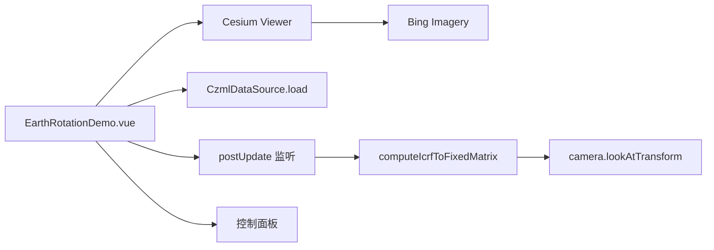

# 地球自转案例

Feature Name: earth-rotation
Updated: 2026-08-26

## Description

独立 Vue 案例，加载 CZML 卫星轨道数据，并通过 `scene.postUpdate` 监听基于 ICRF 惯性系矩阵驱动相机围绕地球自转。提供自转开关与速度滑杆（200~5000），关闭时移除监听并复位相机变换。

## Architecture

## Components and Interfaces

- `src/cases/earth-rotation/EarthRotationDemo.vue`：Viewer、CZML 加载、自转控制与生命周期。
- `src/cases/earth-rotation/data/simple.czml`：卫星轨道示例数据（138KB，复制自参考项目）。
- `src/cases/earth-rotation/index.ts`：案例元数据。
- `src/cases/earth-rotation/icon.webp`：案例卡片图标（1236×655）。
- 自转逻辑（参考 SDK `Navigation` 源码）：
  - `scene.postUpdate` 事件回调中计算 `Transforms.computeIcrfToFixedMatrix(time, icrfToFixed)`
  - `Transforms.headingPitchRollQuaternion` 组合旋转
  - `camera.lookAtTransform(camera.positionWC` 旋转模型矩阵`)`
- 关闭自转时 `scene.postUpdate.removeEventListener` 并 `camera.lookAtTransform(Matrix4.IDENTITY)` 复位。

## Correctness Properties

- 自转开关开启时添加监听，关闭时移除监听并复位相机变换。
- 速度滑杆范围 200 至 5000，调节立即生效。
- 案例卸载后移除监听、销毁 Viewer。
- 本案例不加载地形（与参考项目 015 一致）。

## Error Handling

CZML 数据加载失败时显示错误信息；卸载时 `disposed` 保护避免写入已销毁 Viewer。

## Test Strategy

- 使用 `npm run build` 验证 TypeScript、Vue 模板和 Vite 构建。
- 无头浏览器打开案例，检查数据源加载成功（`dataSources` 数量为 1）、帧推进正常、自转开关切换后无 pageerror。

## References

- [ICRF Inertial Frame](https://cesium.com/learn/cesiumjs-learn/cesiumjs-fixed-frame-vs-inertial/)
