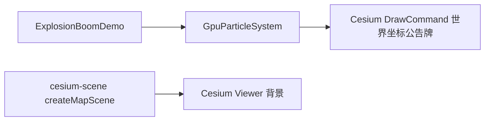

# 双爆炸着色器特效案例

Feature Name: explosion-effects
Updated: 2026-08-24

## Description

噪声云团案例使用 `GpuParticleSystem` 作为单个世界坐标点精灵的 Cesium 绘制载体；点精灵片元着色器融合 Shadertoy Bim Boom Bam 的 gyroid/fbm、growth/fade/burn 与 smoke 密度模型，主导一团不规则云爆的形状和动画。

## Architecture

## Components and Interfaces

- `src/cases/explosion-boom/`：噪声云团爆炸案例。`ExplosionBoomDemo.vue` 直接调用 `GpuParticleSystem`；历史 `boom.frag` 与噪声纹理不再保留（运行时不再加载）。

## 地图叠加与位置定位

- 噪声云团案例的 `ScreenSpaceEventHandler` 左键调用 `viewer.camera.pickEllipsoid` 得到经纬度；输入框与拾取结果同步。
- `GpuParticleSystem.updateEmitter()` 用 `Cartesian3.fromDegrees(lon, lat, height)` 与 `Transforms.eastNorthUpToFixedFrame()` 计算发射器原点、东向量、北向量、上向量。渲染顶点着色器以这些世界坐标构建每个粒子位置。
- 地图相机移动时，Cesium 使用同一 `czm_modelViewProjection` 绘制粒子，因此位置、缩放、地球遮挡与深度测试由场景直接处理，无需屏幕坐标投影或额外 RAF。

## 着色器接口

- 程序化 `sky()` 替换原 cubemap `iChannel1` 背景采样；`computePixelRay` 含 `uAutoRotate` 自动环绕分支。

### GpuParticleSystem（单团地图云爆）

- `ExplosionBoomDemo.vue` 创建 `size: 1`、零速度和零发射半径的 `GpuParticleSystem`，将其作为固定 ENU 世界坐标点精灵；点精灵采用加法混合与深度测试。生命周期参数控制实例的显示时长。
- `GpuParticleSystem` 在 `noise-cloud` 样式中不添加 ComputeCommand；它使用初始化状态纹理提供固定的世界坐标点精灵，避免计算输出纹理和绘制输入纹理形成反馈回路。
- `setPaused()` 和 `setTimeScale()` 控制 DrawCommand 的云爆时间。`ExplosionBoomDemo.vue` 通过 `scene.postRender` 监听用户设置的生命周期终点并隐藏公告牌；重新引爆时销毁 `GpuParticleSystem` 后创建新实例及新监听器。
- `renderParticlesFragmentShader` 的 `noise-cloud` 分支按单次爆炸版本执行：固定 `id=0.5`、8 octave 上限的 `gyroid/fbm`、中心差分法线、余弦调色、烟化混色与 growth/fade 遮罩。片元使用 `cloudAlpha` 输出透明遮罩，公告牌边界区域不修改地图颜色。普通火焰案例保持原平滑圆形粒子分支。

## 参数映射

- 噪声云团案例：云团速度(0.05-8x)、生命周期(0.2-30s)、云团显示尺寸(20-1200px)、噪声尺度(0.1-8)、fbm细节(1-8 octave)、云团密度(0.05-5)、烟化程度(0-5)、爆炸半径(0.02-1.5)、边缘柔和度(0.001-0.5)、调色频率(0.1-30)。

## Correctness Properties

- 渲染层以 `getActiveUniform` 收集 uniform，未声明可选 uniform 时自动跳过；`setUniform` 对数组按长度分发 `uniform2f/3f/4f`。
- 纹理加载失败时抛错并回填 1×1 占位像素，避免白屏；着色器编译/链接失败时组件展示错误信息。
- 透明叠加模式使用非预乘 alpha 混合；着色器透明分支输出反预乘颜色。
- 噪声云团发射器以 WGS84 经纬度转换得到的世界坐标为唯一位置来源；相机变换不会修改发射器位置。
- GPU 粒子 DrawCommand 启用深度测试并使用 Cesium `czm_modelViewProjection`，确保火焰与地球场景共用深度和透视关系。
- 噪声云团案例卸载顺序：销毁点击事件处理器 → 销毁 GPU 粒子系统 → 销毁 Cesium Viewer。
