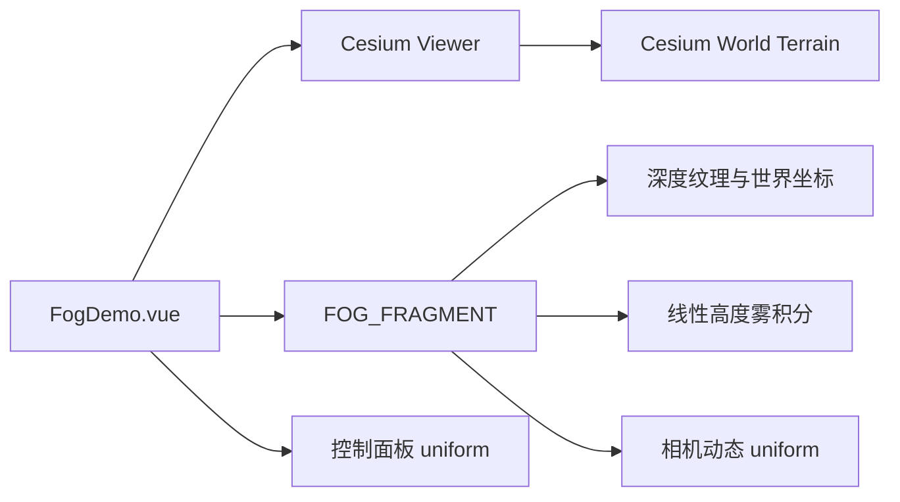

# 深度高度雾案例

Feature Name: fog-effect
Updated: 2026-08-23

## Description

雾案例通过 Cesium `PostProcessStage` 使用深度纹理恢复场景世界坐标，再结合相机高度、像素高程和雾高执行线性高度雾积分。案例继续加载 Bing 影像与 Cesium World Terrain。

## Architecture

## Components and Interfaces

- `src/cases/fog/FogDemo.vue`：Viewer 生命周期、后处理阶段和控制面板。
- `src/cases/fog/FogDemo.vue`：异步地形加载、地形深度配置和后处理生命周期。
- `src/cases/fog/index.ts`：案例元数据。
- `src/lib/weather.ts`：公共 `FOG_FRAGMENT` shader 常量。
- shader uniforms：`u_earthRadiusOnCamera`、`u_cameraHeight`、`u_fogHeight`、`u_fogColor`、`u_globalDensity` 和 `brightness`。

## Correctness Properties

- 后处理关闭时，场景颜色保持基础底图颜色。
- 雾量保持在 `0.0` 至 `0.94` 的有限范围。
- 深度缓冲为空的背景像素保持场景原始颜色。
- 案例卸载后不存在继续更新已移除后处理阶段的帧监听器。
- 地形加载期间不挂载雾后处理，地形加载失败时案例仍能使用基础地球运行。
- 深度纹理为空的背景像素保持场景原始颜色。

## Error Handling

Viewer、底图或后处理初始化失败时，案例显示已有场景状态面板。

## Test Strategy

- 使用 `npm run build` 验证 TypeScript、Vue 模板和 Vite 构建。
- 通过开发服务器请求案例模块，确认 HMR 响应正常。
- 在浏览器预览中检查雾效开关、浓度、高度、亮度控制，以及远景雾和近地雾表现。

## References

- 用户提供的 Cesium 高度雾参考实现
