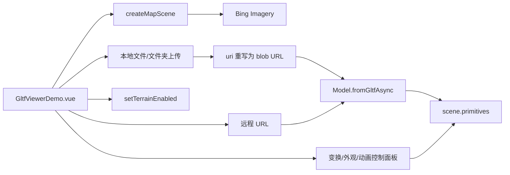

# glTF / GLB 模型查看器案例

Feature Name: gltf-viewer
Updated: 2026-09-06

## Description

独立 Vue 案例，使用 Cesium `Model.fromGltfAsync` 加载远程 URL 或本地文件（含文件夹）的 glTF/GLB 模型，提供位置（经纬高）、旋转（航向/俯仰/翻滚）、缩放（统一或 X/Y/Z 分轴）、外观（包围盒/线框/轮廓/阴影/透明度/色调）、日照光照、自动旋转、地形开关与定位到模型。案例复用公共场景初始化（Bing 影像、Viewer 生命周期），卡片 icon 使用案例运行截图（image-1），右侧控制面板样式与其他案例一致（深蓝玻璃浮卡，无快捷位置）。

## Architecture

## Components and Interfaces

- `src/cases/gltf-viewer/GltfViewerDemo.vue`：完整案例组件（Viewer 生命周期、模型加载、控制面板）。
- `src/cases/gltf-viewer/index.ts`：案例元数据（id `gltf-viewer`，title「glTF/GLB 模型查看器」，category `tiles`，tag「模型加载」，`icon` = `./icon.webp`，即上传的 image-1 截图 1235×647）。
- `src/cases/index.ts`：`gltfViewerCase` import 并追加至卡片列表末尾。
- `vite.config.ts`：`CESIUM_SYMBOLS` 新增 `Model`（dev 模式 cesium 走全局 shim，缺失符号报 `does not provide an export named`）。

## Key Implementation Details

- 公共库：`createMapScene`/`destroyScene`/`loadBingImagery`/`setTerrainEnabled`（`src/lib/cesium-scene.ts`）。
- 位置矩阵：`Transforms.headingPitchRollToFixedFrame(Cartesian3.fromDegrees(lon,lat,height), HPR)`；统一缩放写 `model.scale`，分轴缩放以 `Matrix4.multiply(base, Matrix4.fromScale(...))` 叠加。
- 本地 glTF 加载：解析 JSON 后遍历对象树，把 `uri`/`url` 字段（非 data:/blob: 前缀）按相对路径/文件名在文件 Map 中查找，命中则替换为 `URL.createObjectURL(file)`；GLB 直接 `arrayBuffer` 转 blob（`model/gltf-binary`）。所有 blob URL 统一记录于 `blobUrls`，模型移除/卸载时 `revokeObjectURL` 释放。
- 文件夹选择：隐藏 `input[webkitdirectory]`；拖拽经 `DataTransfer.items.webkitGetAsEntry` 递归遍历目录。
- 外观：`model.debugShowBoundingVolume`/`debugWireframe`/`silhouetteSize`/`silhouetteColor`/`shadows`/`color`（色调 alpha 承载透明度），均置于 try/catch 以兼容运行时不支持字段；每次更新后 `scene.requestRender()`（通过开关事件触发）。
- 阴影光源：开启时 `scene.light = new DirectionalLight({direction, intensity: 3.0})` 并 `scene.shadowMap.enabled=true`，关闭还原 `SunLight`；日照光照独立控制 `globe.enableLighting`。
- 自动旋转：`requestAnimationFrame` 驱动按转速累加航向角并 `applyPosition()`（记录 raf id，切换/卸载时 `cancelAnimationFrame`）。**禁止在 `viewer.clock.onTick` 内逐帧改动 `model.modelMatrix`**：会污染当帧视锥剔除状态，headless SwiftShader 必现 `RangeError: Invalid array length`（`updateFrustums` 中分视锥 length 变 NaN）。
- 状态提示：`SceneCallbacks.onStatus`/`onBasemapReady` 接入加载文案；操作类提示经 4s 定时自动清除。
- 卡片图标：上传的 image-1（案例运行截图，1235×647）复制为 `src/cases/gltf-viewer/icon.webp`，`index.ts` import 后写入 `icon` 字段（与同分类案例的截图缩略图一致）。
- 控制面板样式：`.side-panel` 为右上 compact 浮卡（`top/right:12px`、`max-height:calc(100% - 24px)`、圆角 9、`background rgba(10,26,52,.9)`、`border rgba(157,188,224,.28)`、轻投影、内容区纵向滚动）；无渐变标题栏，标题走文字行；色板使用案例中心通用 token（面板底/文字 `#dce8f5`、标签 `#c3d5e8`、分组标题 `#8ea5c2`、主色 `#2f80ed`、输入框底 `rgba(20,43,80,.75)`），按钮为语义色（主蓝/成功绿/危险红/定位描边）。
- 无快捷位置：不提供八城市切换；已移除 `PRESETS` 常量、`Preset` 类型、`applyPreset`/`flyToPosition`（仅被其引用）及对应模板 section 与 `.preset-row/.preset-btn` 样式；「定位到模型」保留在操作分组。

## Correctness Properties

- 加载模型前先 `removeModel`，避免旧模型残留；`busy` 期间屏蔽再次加载与输入。
- `readyEvent` 触发后重放外观与位置参数；`errorEvent` 仅提示渲染错误，不中断场景。
- 卸载（`onBeforeUnmount`）时置 `disposed`、注销自动旋转、移除模型、释放 blob URL、`destroyScene(viewer)`。
- 无模型时所有变换/外观更新守卫跳过（`isModelAlive`），避免操作空引用。

## Error Handling

- `Model.fromGltfAsync` 抛错 → toast「模型加载失败：<原因>」；本地文件解析异常 → 「glTF 文件解析失败」。
- 地形切换失败回滚开关并提示；加载中 `disposed` 后不再写入已销毁 Viewer。

## Test Strategy

- `npx vue-tsc -b --force` 0 error；`npm run build` EXIT=0。
- 无头浏览器打开案例，断言 Viewer 就绪、上传/URL 加载路径无 pageerror、控制面板与开关可用。

## References

- [glTF Specification](https://github.com/KhronosGroup/glTF)
- CesiumJS 1.144 `Model.fromGltfAsync` API
