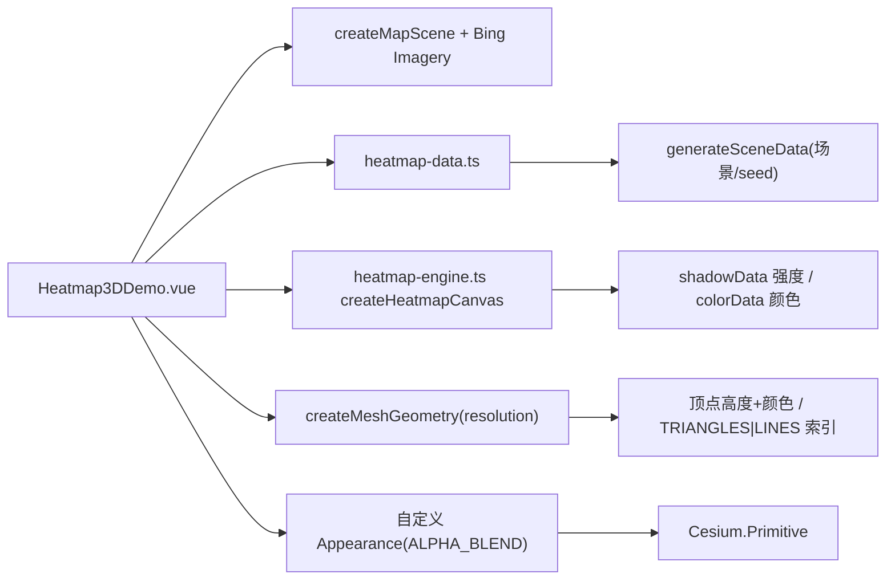

# 三维热力图案例

Feature Name: heatmap-3d
Updated: 2026-08-27

## Description

根据数据动态生成三维热力网格地形。复用 `heatmap-lib` 公共模块生成热力强度/颜色像素数组，构建 `resolution×resolution` 顶点网格（每顶点高度 = 强度×高度倍率 + 基准高度，颜色从热力像素数组采样），支持面状（TRIANGLES）/ 网格（LINES 线框）形式切换与全套参数调节。参考移植自用户上传样例（`b9526954-long-input-20260827-060413.txt`）。

## Architecture

## Components and Interfaces

- 复用 `src/cases/heatmap-lib/heatmap-engine.ts`：`createHeatmapCanvas` 导出 `shadowData`（强度 alpha 数组）与 `colorData`（着色后像素数组）。
- 复用 `src/cases/heatmap-lib/heatmap-data.ts`：`heatmapScenes` 与 `generateSceneData`。
- `src/cases/heatmap-3d/Heatmap3DDemo.vue`：
  - 场景：`createMapScene` + `loadBingImagery`；`camera.setView(Rectangle.fromDegrees(bounds 外扩 0.6°))`。
  - `createMeshGeometry(resolution, bounds, heatmap)`：
    - 顶点 `resolution×resolution`，`lon/lat` 按网格索引插值，canvas 像素坐标对应；`intensity = shadowData[..+3]/255`，`height = baseElevation + intensity × heightScale`；颜色取 `colorData`（RGB + alpha×整体透明度）。
    - TRIANGLES 索引：每格 2 三角形（TL-BL-BR / TL-BR-TR）；LINES 索引：行水平线 + 列垂直线。
    - 索引用 `Uint16Array`（最大索引 ≤ 65535）或 `Uint32Array`。
  - 外观：自定义 `Appearance`（`renderState.depthTest.enabled=false` + `cull.enabled=false` + `BlendingState.ALPHA_BLEND`，顶点着色器 `czm_translateRelativeToEye` + `in vec4 color`，片元 `out_FragColor`）；`Primitive` 设 `asynchronous:false`。
  - 面板：数据源（场景 select + 随机生成 + hint）、形态（面状/网格 toggle）、渲染参数（半径/模糊度/网格分辨率/热力分辨率/高度倍率/基准高度/透明度滑块）、色带 select + 渐变图例、固定范围 toggle + min/max、指标（数据范围/网格顶点数）。
- `src/cases/heatmap-3d/index.ts`：`effects` 分类，标题「数据分析-三维热力图」，tag「三维数据」。

## Correctness Properties

- 每顶点强度与颜色均从热力像素数组一次索引取得（无逐像素 `getImageData`），网格分辨率 120² 也可流畅构建。
- 网格坐标映射与 2D 热力图一致：`x=(lon-west)/lonRange*canvasW`、`y=(north-lat)/latRange*canvasH`，保证颜色/高度与 2D 显示一致。
- 透明度：顶点 alpha = 热力像素 alpha × 整体透明度，`ALPHA_BLEND` 混合。
- 卸载：`primitives.remove` + `destroyScene(viewer)`。

## Error Handling

- 地图初始化失败：`status-mask` 显示错误信息。
- heatmap 像素数组缺失时顶点回退默认灰蓝色，不崩溃。

## Verification Plan

- `npm run build`（vue-tsc + vite）通过。
- 无头浏览器（Playwright + swiftshader）：进入「三维特效」分类点击卡片，面板标题「三维热力图」、指标显示数据范围与网格顶点数、primitives=1；面状彩色像素占比高；切换网格 LINES 模式后彩色像素降低（线框）；场景切换生效；零 pageerror。
