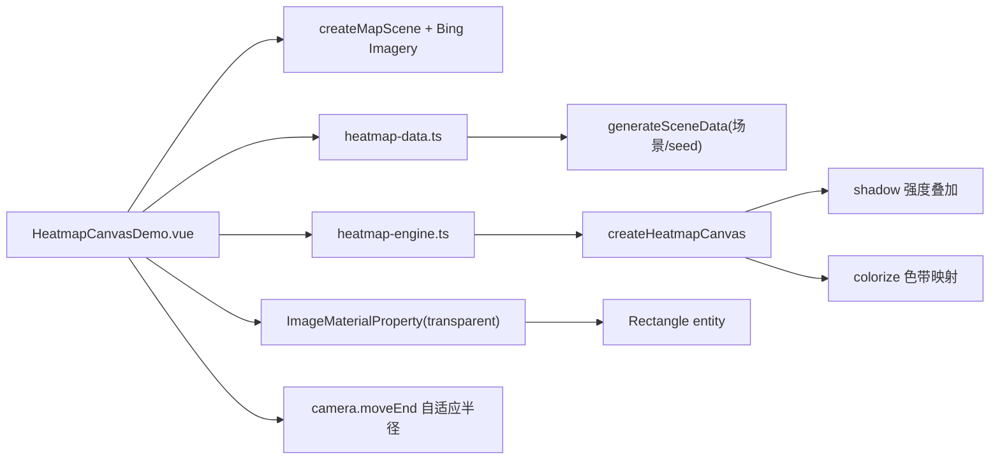

# 热力图案例

Feature Name: heatmap-canvas
Updated: 2026-08-27

## Description

根据数据动态生成 Canvas 密度热力图并叠加在影像底图上。核心移植 leaflet.heat（h337）的 Canvas 渲染流程（径向渐变圆叠加强度 + 色带映射），数据与渲染引擎抽离为公共模块 `heatmap-lib`（3D 热力图案例复用），支持多场景数据切换、随机重新生成与全套渲染参数调节。

## Architecture

## Components and Interfaces

- `src/cases/heatmap-lib/heatmap-engine.ts`：
  - `buildPalette(gradient, size=256)`：渐变 stops → 256 色查色表（RGB 每像素）。
  - `createPointTemplate(radius, blurFactor)`：径向渐变圆 sprite（`blur>=1` 实心圆，否则内黑外透明）。
  - `createHeatmapCanvas(points, bounds, options)` → `{ canvas, getValueAt, shadowData, colorData, min, max, width, height }`：
    - 画布尺寸按 `canvasWidth` 与 bounds 纵横比；点映射 `x=(lon-west)/lonRange*width`、`y=(north-lat)/latRange*height`。
    - shadow canvas 逐点 `globalAlpha = clamp((value-min)/(max-min))` + `drawImage(sprite)` 强度累积。
    - colorize：`shadowContext.getImageData` → 每像素按 alpha 查 palette，alpha 夹取到 `[minOpacity, maxOpacity]` → 输出。
    - `shadowData`/`colorData` 为一次性导出的强度/着色像素数组（供 3D 采样，避免逐像素 `getImageData`）。
- `src/cases/heatmap-lib/heatmap-data.ts`：`heatmapScenes`（北京多中心 clusters / 上海沿江带状 band / 广州环形 ring / 成都核心聚集 core，含 bounds/defaultRadius/pointCount）；`generateSceneData(scene, seed)` 用 seededRandom + Box-Muller 高斯生成 0~1000 值域模拟点，支持随机种子。
- `src/cases/heatmap-canvas/HeatmapCanvasDemo.vue`：
  - 场景：`createMapScene` + `loadBingImagery`；`camera.setView(Rectangle.fromDegrees(bounds 外扩 0.6°))`。
  - 渲染：`createHeatmapCanvas` → `canvas.toDataURL()` → `new Cesium.ImageMaterialProperty({ image: dataUrl, transparent: true })` 赋给 rectangle entity 的 material；数据/参数变更时重新生成并替换 `entity.rectangle.material`。
  - 面板：数据源（场景 select + 随机生成 + 场景/点数 hint）、渲染参数（半径/最大透明度/最小透明度/模糊度/画布宽度滑块）、色带 select + 渐变图例、固定范围 toggle + min/max 输入、相机自适应半径 toggle、指标（数据范围/点数）。
  - 相机自适应：`camera.moveEnd` 按 `camera.getMagnitude()` 在 `[6375000, 10000000]` 间把 radius 从初始值线性插值到 120，变更时重绘；卸载移除监听。
- `src/cases/heatmap-canvas/index.ts`：`data` 分类，标题「数据分析-热力图」，tag「数据可视化」。

## Correctness Properties

- 热力渲染两段式与 leaflet.heat 一致：shadow 强度累积（source-over）+ colorize 查色；`transparent: true` 保留 alpha 不显示黑底。
- 随机生成使用 `Math.random()` 新种子，保证每次不同；场景固定种子可复现。
- 卸载：移除 moveEnd 监听、`entities.remove`、`destroyScene(viewer)`。

## Error Handling

- 地图初始化失败：`status-mask` 显示错误信息。
- canvas `getContext('2d')` 失败：返回空结果不崩溃。

## Verification Plan

- `npm run build`（vue-tsc + vite）通过。
- 无头浏览器（Playwright + swiftshader）：进入「数据可视化」分类点击卡片，面板标题「热力图」、hint 显示场景与点数、图例渐变正常、彩色像素占比高；场景切换 / 色带切换 / 随机生成均更新渲染；零 pageerror。
