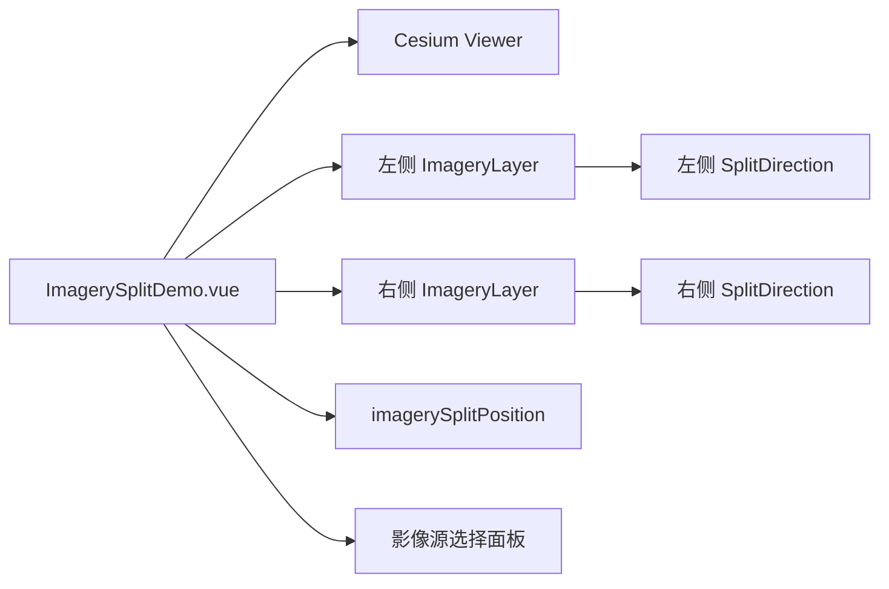

# 影像卷帘对比

Feature Name: imagery-split
Updated: 2026-08-23

## Description

案例复用公共 Cesium Viewer，在同一 `ImageryLayerCollection` 中维护左右两层影像。每层通过 `ImageryLayer.splitDirection` 指定裁剪方向，Viewer 通过 `scene.splitPosition` 统一控制分界比例。

## Architecture

## Components and Interfaces

- `src/cases/imagery-split/ImagerySplitDemo.vue`：Viewer 生命周期、左右影像层、卷帘位置和控制面板。
- `src/cases/imagery-split/index.ts`：案例元数据和首页注册入口。
- `src/lib/bing.ts`：创建 Bing 影像源。
- `src/lib/tianditu.ts`：创建天地图影像和注记源。

## Data Models

- `ImagerySource`：`bing`、`tianditu`、`tianditu-label`。
- `Side`：`left` 或 `right`。
- `splitPosition`：范围为 `0.02` 到 `0.98` 的滑块值。

## Correctness Properties

- 左侧图层始终使用 `SplitDirection.LEFT`，右侧图层始终使用 `SplitDirection.RIGHT`。
- 更换一侧影像源只替换对应侧图层。
- 滑块数值与 `viewer.scene.splitPosition` 保持一致。
- 案例卸载后 Viewer、左右图层和相关引用均释放。

## Error Handling

影像源创建异常通过控制面板展示对应侧错误文本，Viewer 初始化异常通过状态遮罩展示。

## Test Strategy

- 使用 `npm run build` 验证 Vue 模板、Cesium 类型和资源构建。
- 浏览器验证两侧影像、左右源切换、滑块拖动、移动端面板和案例卸载。
