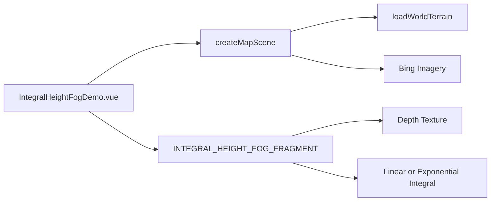

# 浓度积分高度雾设计

Feature Name: integral-height-fog
Updated: 2026-08-23

## 描述

新增独立 Vue 案例，使用 Cesium `PostProcessStage` 读取深度纹理并恢复像素世界坐标。shader 根据相机到像素的有效视线路径，裁剪进入雾层的部分，再执行线性或指数密度积分。

## 架构

## 组件与接口

- `src/lib/cesium-scene.ts`：提供统一 `loadWorldTerrain(viewer)`，请求 World Terrain 顶点法线并设置 provider。
- `src/cases/integral-height-fog/IntegralHeightFogDemo.vue`：案例 Viewer、参数面板和后处理生命周期。
- `src/lib/weather.ts`：提供浓度积分高度雾 shader。
- shader uniform：地球半径、相机高度、雾高、雾颜色、全局浓度、指数衰减、起始距离、积分模式和亮度。

## 正确性约束

- 背景深度为 1.0 时保留场景颜色。
- 起始距离以内的视线路径不累计雾量。
- 线性模式使用平均线性密度，指数模式使用指数密度积分。
- 案例卸载后后处理阶段和 Viewer 均释放。
- 所有 World Terrain 案例共享公共加载入口。

## 错误处理

- 地形加载期间显示状态遮罩。
- 地形或 Viewer 初始化失败时展示错误信息。
- 异步地形完成后，Viewer 已销毁时停止后续场景写入。

## 测试策略

- 执行 `npm run build` 验证 Vue、TypeScript 和 Vite 构建。
- 执行 `git diff --check` 验证差异格式。
- 通过预览打开案例，检查开关、线性/指数模式和所有参数滑杆。
