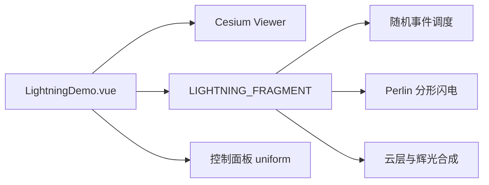

# 闪电效果案例

Feature Name: lightning-effect
Updated: 2026-08-22

## Description

新增独立 Vue 案例组件，通过 Cesium `PostProcessStage` 将 Shadertoy `fsdGWf` 的程序化雷电逻辑适配为 GLSL 300 后处理 shader。效果叠加在天地图场景上，案例面板控制效果开关、频率、强度、云层和亮度。

## Architecture

## Components and Interfaces

- `src/cases/lightning/LightningDemo.vue`：Viewer 生命周期、后处理阶段、动画时间和控制面板。
- `src/cases/lightning/index.ts`：案例元数据。
- `src/lib/weather.ts`：公共 `LIGHTNING_FRAGMENT` shader 常量。
- shader uniforms：`time`、`frequency`、`intensity`、`cloudCover`、`brightness`。

## Correctness Properties

- 后处理关闭时，场景颜色保持基础底图颜色。
- `frequency`、`intensity`、`cloudCover` 和 `brightness` 的范围均映射为有限 GLSL uniform 值。
- 案例卸载后不存在继续更新已移除后处理阶段的帧监听器。

## Error Handling

Viewer 或底图初始化失败时，案例显示已有场景状态面板；后处理创建失败时，错误信息显示在同一状态面板中。

## Test Strategy

- 使用 `npm run build` 验证 TypeScript、Vue 模板和 Vite 构建。
- 通过开发服务器请求案例模块，确认 HMR 响应正常。
- 在浏览器预览中检查闪电开关、四项滑杆、闪电触发和案例卸载。

## References

- [Shadertoy fsdGWf](https://www.shadertoy.com/view/fsdGWf)
