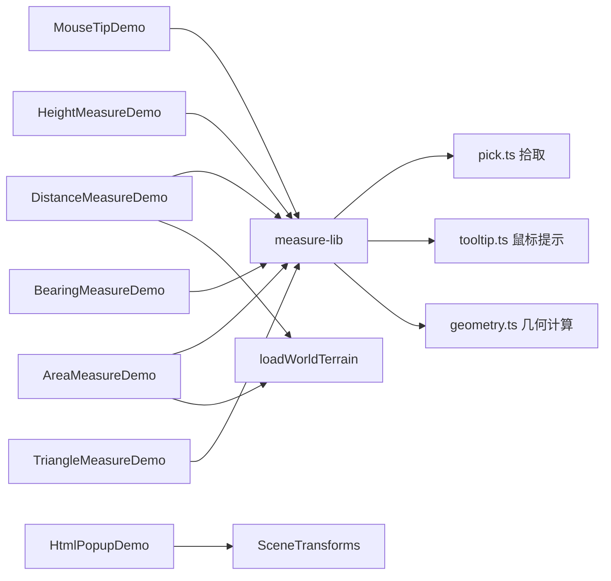

# 鼠标提示、HTML 弹窗与常规量测案例

Feature Name: measure-tools
Updated: 2026-08-23

## Description

7 个案例分为两类：2 个信息展示类（鼠标移动提示、自定义 HTML 弹窗）与 5 个量测类（距离、面积、高度、方位角、三角）。量测类案例共享 `measure-lib` 库，统一实现点位拾取、鼠标 tooltip、几何量算与结果格式化。所有案例使用公共 `createMapScene` 创建 Cesium Viewer，量测案例额外加载 Cesium World Terrain。

## Architecture

## Components and Interfaces

- `src/cases/measure-lib/pick.ts`：`pickPosition`/`pickCartographic`，优先 `scene.pickPosition` 深度拾取，回退射线与椭球拾取。
- `src/cases/measure-lib/tooltip.ts`：`MouseTooltip`，跟随鼠标的浮层。
- `src/cases/measure-lib/geometry.ts`：空间/地表/投影距离与面积、方位角、高差、三角形信息、格式化函数。
- `src/cases/mouse-tip/`：鼠标移动提示案例。
- `src/cases/html-popup/`：自定义 HTML 弹窗案例，弹窗锚定世界坐标，`preRender` 中经 `SceneTransforms.worldToWindowCoordinates` 更新屏幕位置。
- `src/cases/distance-measure/`、`src/cases/area-measure/`、`src/cases/height-measure/`、`src/cases/bearing-measure/`、`src/cases/triangle-measure/`：五个量测案例。

## 几何算法

### 距离

- 空间距离：`Cartesian3.distance(a, b)`。
- 投影距离：将两点投影到 WGS84 椭球（高度 0），用 `EllipsoidGeodesic.surfaceDistance`。
- 地表距离：沿 `EllipsoidGeodesic` 大圆插值 40 段，每段取 `scene.globe.getHeight` 地形高度，累加段间三维距离。

### 面积

- 空间面积：从首顶点扇形三角剖分，每个三角形用 Heron 公式按三维边长求和。
- 投影面积：在局部 ENU 平面将顶点转换后按鞋带公式计算。
- 地表面积：对每个剖分三角形递归细分 4 层，边中点沿地形表面取高程，累加小三角形面积。

### 方位角与三角

- 方位角：`EllipsoidGeodesic.startHeading` 转十进制度，0-360 归一化，映射八方向象限。
- 三角：三边空间距离、余弦定理求内角、周长、Heron 面积。

## Correctness Properties

- 拾取顺序：深度拾取（三维模型/地形）→ 地形射线拾取 → 椭球拾取，保证三维模型与地形上都能取点。
- tooltip 用 `pointer-events: none` 避免干扰点击。
- 量测交互统一：单击加点、双击或右键结束、清除按钮重置；移动鼠标实时提示临时结果。
- 地表计算前检查 `worldTerrainLoaded`，地形未加载时回退为空间值。
- 地图交互用 `PointPrimitiveCollection` 与 `PolylineCollection` 批量管理，避免逐实体开销。
- 案例卸载时销毁 handler、tooltip、地形与 Viewer，并移除全部图元集合。

## Error Handling

- 地形加载失败显示提示并保持无地形量测。
- 点数不足时提示用户继续采集。
- 底图失败沿用 `loadBingImagery` 的错误提示机制。

## Test Strategy

- 使用 `npm run build` 验证 TypeScript、Vue 模板和 Vite 构建。
- 通过开发服务器请求案例模块，确认 HMR 响应正常。
- 浏览器预览中验证：鼠标提示跟随、弹窗随地球拖动、三类距离/面积切换、高度/方位角/三角结果、地形开关与卸载清理。
