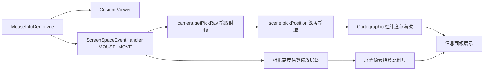

# 鼠标位置案例

Feature Name: mouse-info
Updated: 2026-08-23

## Description

新增独立 Vue 案例组件，通过 `ScreenSpaceEventHandler` 监听鼠标移动，实时拾取鼠标对应地面点，展示经纬度与海拔；同时根据相机高度估算 Web Mercator 缩放层级，并计算屏幕 1 厘米对应的实际地面距离。

## Architecture



## Components and Interfaces

- `src/cases/mouse-info/MouseInfoDemo.vue`：Viewer 生命周期、鼠标事件、拾取计算与信息面板。
- `src/cases/mouse-info/index.ts`：案例元数据。
- `src/cases/mouse-info/icon.webp`：案例卡片图标。
- 复用 `src/lib/cesium-scene.ts` 的 `createMapScene`、`destroyScene`、`loadBingImagery`。

### 拾取策略

1. `camera.getPickRay(windowPosition)` 构造拾取射线。
2. 优先 `scene.pickPosition(windowPosition)` 获取深度缓冲区重建的地面点。
3. 若深度拾取不可用或未命中，使用 `scene.globe.pick(ray, scene)` 拾取地表交点。
4. 最终回退 `camera.pickEllipsoid(windowPosition)` 获取椭球面交点。
5. 拾取结果转为 `Cartographic`，经度、纬度以十进制度展示，海拔以米展示。

### 缩放层级估算

Cesium 无公开的缩放层级 API，采用相机高度估算 Web Mercator 层级：

```typescript
const level = Math.max(0, Math.round(
  Math.log2(40075016.686 / (256 * metersPerPixel)) * Math.cos(cameraCarto.latitude)
))
```

`metersPerPixel` 根据视口高度、相机高度与纵向视场角计算。

### 比例尺计算

- 取屏幕中心与右侧相距 `N` 像素的两点，分别拾取地面坐标。
- 计算两点间地表距离（米），除以像素间隔得到每像素地面距离。
- 按 96 DPI（1 厘米约 37.8 像素）换算每厘米地面距离。
- 距离大于等于 1000 米时以千米展示，否则以米展示。

## Correctness Properties

- 鼠标事件监听器在组件卸载时移除。
- 相机高度非正或像素距离不可计算时，比例尺显示占位文本。
- 深度拾取不可用时静默回退到地表或椭球拾取，不抛出异常。
- 未命中地表时保留最近一次有效读数。

## Error Handling

- 拾取结果不存在时，经纬度与海拔区域显示占位文本。
- Viewer 初始化异常时，案例显示状态面板。

## Test Strategy

- 使用 `npm run build` 验证 TypeScript、Vue 模板和 Vite 构建。
- 在浏览器预览中移动鼠标，检查经纬度、海拔实时刷新。
- 调整相机高度，检查缩放层级与比例尺随视角变化。
