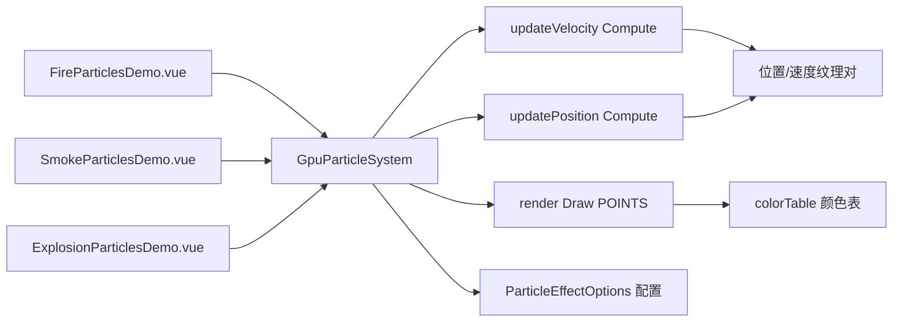

# GPU 粒子效果案例（火焰/烟雾/爆炸）

Feature Name: particle-effect
Updated: 2026-08-23

## Description

三个粒子效果案例共享一套 GPU 计算粒子系统库。粒子位置与速度分别存储在两对 RGBA `Float32` 纹理中，通过两次 `ComputeCommand`（速度更新、位置更新）逐帧迭代，再经 `DrawCommand` 以 `GL_POINTS` 点精灵渲染。粒子状态为相对发射点的 ENU 局部坐标，渲染时经发射点 ECEF 与东/北/上基向量转换到世界坐标。

## Architecture



## Components and Interfaces

- `src/cases/particle-effect/lib/gpuParticleSystem.ts`：`GpuParticleSystem` 主类，管理纹理对、计算/渲染命令、发射点 ENU 基向量、参数更新与生命周期。
- `src/cases/particle-effect/lib/shaders.ts`：四个 GLSL `#version 300 es` shader 源码常量（速度更新、位置更新、渲染顶点、渲染片元）。
- `src/cases/particle-effect/lib/types.ts`：`ParticleEffectOptions` 等类型定义。
- `src/cases/particle-effect/lib/customPrimitive.ts`：`ComputeCommand`/`DrawCommand` 封装的自定义图元（与风场案例同源复用）。
- `src/cases/fire-particles/`：火焰案例（Demo.vue、index.ts、icon.webp）。
- `src/cases/smoke-particles/`：烟雾案例（Demo.vue、index.ts、icon.webp）。
- `src/cases/explosion-particles/`：爆炸案例（Demo.vue、index.ts、icon.webp）。
- `src/cesium-render.d.ts`：Cesium 内部渲染类型补充声明（由 wind 案例目录提升至共享）。

## ParticleEffectOptions 数据契约

```typescript
type ParticleEffectOptions = {
  size: number                 // 粒子纹理边长，粒子数 = size * size
  emitter: { lon, lat, height } // 发射点
  colors: string[]             // 颜色表
  blendMode: 'additive' | 'alpha'
  lifetime: [number, number]   // 寿命范围（秒）
  initialSpeed: [number, number]
  coneAngle: number            // 发射锥角（弧度），>= PI 时为全向
  gravity: number
  drag: number
  turbulence: number
  lift: number
  emissionRate: number         // 连续发射重生概率
  continuous: boolean
  pointSize: [number, number]
  pointGrowth: number
  emitterRadius: number
  heightScale: number
  initializer: 'emitter' | 'sphere'
  emitAll: boolean
  displayRange: [number, number]
}
```

## GPU 数据流

1. 位置纹理 rgba = (x, y, z, life)，速度纹理 rgba = (vx, vy, vz, seed)。
2. `updateVelocity` 计算命令读当前位置与速度，应用浮力、重力、阻力与湍流，输出新速度；粒子死亡时按重生概率在发射锥内生成新速度与新种子。
3. `updatePosition` 计算命令读当前位置与新速度，位移并衰减寿命；死亡粒子按相同概率与随机种子在发射圆盘上重生。
4. 两计算命令间纹理做乒乓交换：当前速度纹理对与位置纹理对在 `preExecute` 中轮换，输出纹理同步更新，避免读写同一纹理。
5. `render` 绘制命令以点精灵渲染，顶点 `st` 属性对应粒子在纹理中的归一化坐标，片元按寿命采样颜色表并做圆形软边缘与尾部淡出。

## Correctness Properties

- 位置/速度纹理均以 `NEAREST` 采样，避免插值污染粒子状态。
- 颜色表纹理以 `LINEAR` 采样并提供 `CLAMP_TO_EDGE` 环绕，保证首尾颜色平滑。
- `preExecute` 中统一计算 `deltaTime`（钳制最大 0.1s）与每帧随机种子，保证速度与位置两计算命令使用一致的随机判定。
- 重生判定条件在速度与位置两个 shader 中保持一致（相同的 hash 表达式与概率），避免速度重生而位置未重生导致错位。
- 爆炸案例 `continuous: false`，粒子死亡后不再重生，通过 `restart()` 重建纹理实现重新引爆。
- 渲染开启 `depthTest`、关闭 `depthMask`，粒子正确被地形遮挡且互不写入深度。
- 案例卸载时释放全部纹理、颜色表、计算/绘制命令、点击事件处理器与 Viewer。

## Error Handling

- 底图加载失败时显示失败提示，保留案例可重试入口。
- 粒子参数由滑块约束在合法范围内，避免零值或越界输入。

## Test Strategy

- 使用 `npm run build` 验证 TypeScript、Vue 模板和 Vite 构建。
- 通过开发服务器请求案例模块，确认 HMR 响应正常。
- 浏览器预览中验证三种效果的粒子运动、颜色渐变、混合模式、点击设置发射点/引爆、参数实时调整与卸载清理。
