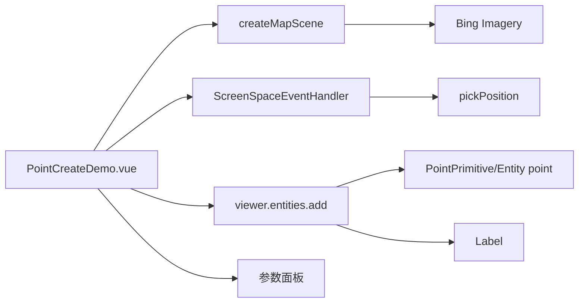

# 标点创建-动态点标注案例

Feature Name: point-create
Updated: 2026-08-26

## Description

独立 Vue 案例，鼠标点击地图动态创建点标注。提供点大小、填充颜色、轮廓宽度、点高度、贴地与标签显示等参数，参数变更实时应用到已创建的点。

## Architecture

## Components and Interfaces

- `src/cases/point-create/PointCreateDemo.vue`：Viewer 创建、点击拾取、点实体与标签创建、参数面板。
- `src/cases/point-create/index.ts`：案例元数据，分类 `draw`（标记标绘）。
- `src/cases/point-create/icon.webp`：案例卡片图标（用户上传 image-1 替换）。
- 点参数：`pixelSize`（3~40）、填充色（预设色板 7 色）、轮廓宽度（0~6）、点高度（米）、贴地（`HeightReference.CLAMP_TO_GROUND`）、标签显示（`P1/P2/...` 序号 + 底部色块）。
- 点位参数实时更新：`watch` 监听各参数后遍历 `viewer.entities` 修改对应 `point`/`label` 属性；`pointHeight` 变更时用 `Cartographic` 反解经纬度后重建 `Cartesian3`。

## Correctness Properties

- 点击地图创建点后 `pointCount` 自增，结果面板显示该点经纬度与高度。
- 全部已创建点的参数随面板调整实时更新。
- 贴地开启时 `heightReference = CLAMP_TO_GROUND`，高度参数为 0 时保留拾取位置原始高度。
- 案例卸载后销毁 handler 与 Viewer。

## Error Handling

地图加载失败时显示错误信息；`disposed` 保护避免写入已销毁 Viewer。

## Test Strategy

- 使用 `npm run build` 验证 TypeScript、Vue 模板和 Vite 构建。
- 无头浏览器打开案例点击地图 3 次，断言场景中存在 3 个 point 实体与 3 个 label；调整大小滑杆后断言 `pixelSize` 从 10 变为 30。

## References

- Cesium `Entity.point` 与 `Entity.label` 文档。
