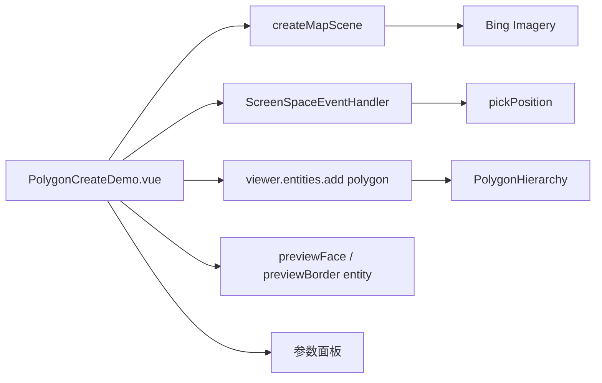

# 线面绘制-动态多边形面案例

Feature Name: polygon-create
Updated: 2026-08-26

## Description

独立 Vue 案例，鼠标点击地图动态创建多边形面。支持填充颜色、透明度、面高度、边框开关/宽度/颜色与贴地参数，参数变更实时应用到已绘制的多边形。绘制过程中提供实时预览（面 + 首尾闭合边框）。

## Architecture

## Components and Interfaces

- `src/cases/polygon-create/PolygonCreateDemo.vue`：Viewer 创建、点击加点、右键/双击闭合、多边形与边框实体创建、参数面板。
- `src/cases/polygon-create/index.ts`：案例元数据，分类 `draw`（标记标绘）。
- `src/cases/polygon-create/icon.webp`：案例卡片图标（用户上传 image-3 替换）。
- 面参数：填充颜色（预设色板 7 色）、透明度（0~1）、面高度（米）、边框显示/宽度（1~10）/颜色（取色器）、贴地。
- 边框以独立 polyline 实体绘制（顶点首尾闭合），便于单独控制宽度与颜色。
- 绘制交互：`LEFT_CLICK` 采集顶点，`RIGHT_CLICK` 或 `LEFT_DOUBLE_CLICK` 闭合生成多边形。
- 实时预览：`createPreviewEntities()` 建 `__preview-face__`/`__preview-border__` 实体；`updatePreview()` 更新面 `PolygonHierarchy`（≥3 点显示）与边框 `positions`；`finishPolygon` 隐藏预览。
- 贴地不设 `PolygonGraphics.clampToGround`（属性不存在），用 `height: 0 + heightReference: CLAMP_TO_GROUND`；预览面与最终面同步该方案。
- 预览面 `hierarchy` 仅当顶点 ≥3 且 `lastPreviewPos` 与刚采集点不同（点击瞬间 MOUSE_MOVE 先于 LEFT_CLICK，位置会重合）时才 `setValue`，避免 1~2 点或重复顶点导致 `PolygonGeometryUpdater._computeCenter` 质心退化产生 NaN（`cartesian has a NaN component`）。

## Correctness Properties

- 顶点不足 3 个时结束绘制会提示"点数不足"。
- 已绘多边形参数随面板调整实时更新（`updateExistingPolygons` 遍历实体修改 `material`/`height`/`heightReference` 及边框 polyline 的 `width`/`material`/`clampToGround`/`show`）。
- 透明度经 `Color.fromCssColorString` 后直接改 `alpha` 再赋给 `material`。
- 边框 polyline 始终创建，显示边框开关经 `updateExistingPolygons` 切换 `polyline.show`。
- 案例卸载后销毁 handler 与 Viewer。

## Error Handling

地图加载失败时显示错误信息；`disposed` 保护避免写入已销毁 Viewer。

## Test Strategy

- 使用 `npm run build` 验证 TypeScript、Vue 模板和 Vite 构建。
- 无头浏览器打开案例：绘制中断言预览面 `hierarchy` 3 点、预览边框 4 点且零 NaN 错误；点击 4 次并右键闭合，断言场景中存在 1 个 polygon 实体与 1 个 polyline 边框实体；调整透明度滑杆后断言 `material.getValue(0).color.alpha` 从 0.5 变为 0.9；切换显示边框开关后断言 `polyline.show` 由 true 变 false；全程无 pageerror。

## References

- Cesium `Entity.polygon`、`PolygonHierarchy`、`PolygonGeometryUpdater`、`GroundGeometryUpdater` 文档。
