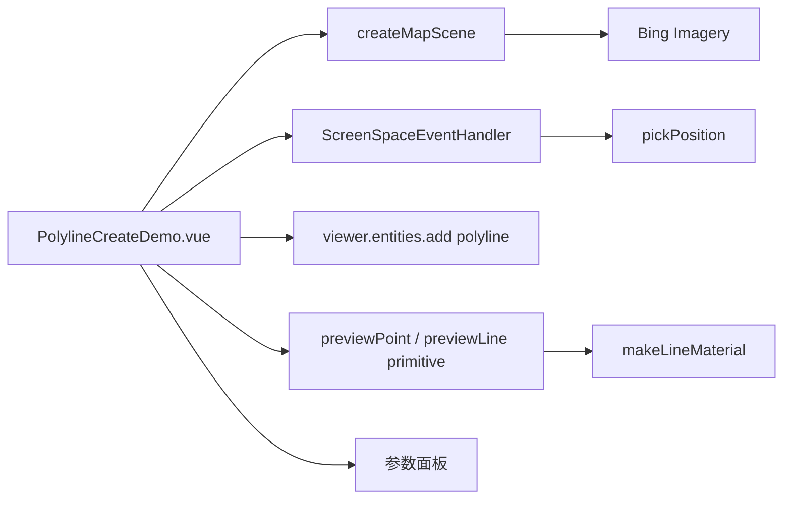

# 线面绘制-动态折线案例

Feature Name: polyline-create
Updated: 2026-08-26

## Description

独立 Vue 案例，鼠标点击地图动态创建折线。支持线宽、线颜色、线型（实线/虚线/发光/描边）、贴地与顶点显示参数，参数变更实时应用到已绘制的折线。绘制过程中提供实时预览（已采集点 + 到鼠标的预览线）。

## Architecture

## Components and Interfaces

- `src/cases/polyline-create/PolylineCreateDemo.vue`：Viewer 创建、点击加点、右键/双击结束、折线实体创建、参数面板。
- `src/cases/polyline-create/index.ts`：案例元数据，分类 `draw`（标记标绘）。
- `src/cases/polyline-create/icon.webp`：案例卡片图标（用户上传 image-2 替换）。
- 线参数：线宽（1~12）、线颜色（预设色板 7 色）、线型（`solid` 实线 / `dash` 虚线 `PolylineDashMaterialProperty` / `glow` 发光 `PolylineGlowMaterialProperty` / `outline` 描边 `PolylineOutlineMaterialProperty`）、贴地（`clampToGround`）、显示顶点（折线端点用独立 point 实体绘制）。
- 绘制交互：`LEFT_CLICK` 采集顶点，`RIGHT_CLICK` 或 `LEFT_DOUBLE_CLICK` 结束折线。
- 实时预览：`MOUSE_MOVE` 更新 `lastPreviewPos`；`updatePreview()` 先 `removeAll` 再重绘已采集点（`PointPrimitiveCollection`）与到鼠标的预览线（`PolylineCollection`）。
- 预览线材质必须为 `Material` 实例（`makeLineMaterial` 生成半透明 Color 材质）；`PolylineCollection` 的 polyline `material` setter 仅接受 `Material`，传 `Color` 会在销毁时因 `this._material.destroy is not a function` 崩溃并停止渲染。
- 顶点实体始终创建并存入 `vertexEntities`，显示顶点开关经 `applyShowPoints()` 统一设置各实体 `point.show`（不依赖创建时机）。

## Correctness Properties

- 顶点不足 2 个时结束绘制会提示"点数不足"。
- 已绘折线参数随面板调整实时更新（`updateExistingLines` 遍历实体修改 `width`/`material`/`clampToGround`）。
- 显示顶点开启时每个顶点绘制白心彩色描边小圆点，关闭时全部隐藏。
- 案例卸载后销毁 handler 与 Viewer。

## Error Handling

地图加载失败时显示错误信息；`disposed` 保护避免写入已销毁 Viewer。

## Test Strategy

- 使用 `npm run build` 验证 TypeScript、Vue 模板和 Vite 构建。
- 无头浏览器打开案例：绘制中断言 `PolylineCollection` 含 1 条预览线、`PointPrimitiveCollection` 含 N 个预览点；点击 4 次并右键结束，断言场景中存在 1 个 polyline 实体与 N 个顶点实体；切换显示顶点开关后断言各顶点实体 `point.show` 由 true 变 false；全程无 pageerror。

## References

- Cesium `Entity.polyline`、`PolylineCollection`、`PointPrimitiveCollection`、`PolylineDashMaterialProperty`、`PolylineGlowMaterialProperty`、`PolylineOutlineMaterialProperty` 文档。
