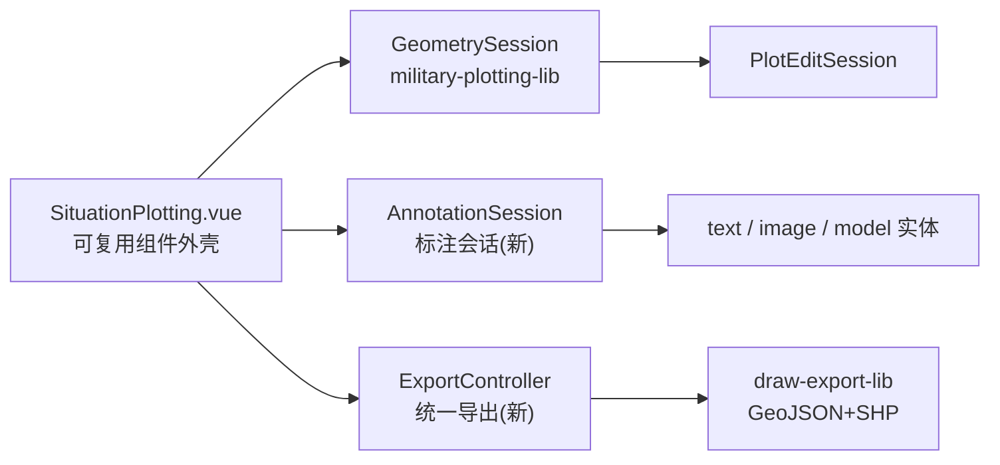

# 技术设计：综合态势标绘组件案例

## 1. 总览

复用 `military-plotting-lib`（21 种几何标绘 + `PlotEditSession` 编辑）与 `draw-export-lib`（GeoJSON/SHP 多坐标系），新增三类点状标注（文本/图片/模型）的会话、可复用 UI 组件与统一导出，并把全部能力整合为一张综合案例卡片。

## 2. 文件结构

- `src/cases/situation-plotting-lib/SituationPlotting.vue`：可复用组件外壳（viewer 生命周期 + 工具栏 + 属性面板 + 导出面板）。
- `src/cases/situation-plotting-lib/annotation-session.ts`：标注会话。
- `src/cases/situation-plotting-lib/annotation-types.ts`：标注类型/常量/工厂。
- `src/cases/situation-plotting-lib/export-controller.ts`：统一导出控制器。
- `src/cases/situation-plotting/`：`index.ts`（DemoCard 注册）+ `Demo.vue`（薄壳引用 `SituationPlotting.vue`）。
- `src/cases/draw-export-lib/shapefile.ts`：扩展 DBF 属性字段（向后兼容）。

## 3. 可复用组件外壳（SituationPlotting.vue）

- 自建 `createMapScene` + `loadBingImagery` 场景，卸载时 `destroyScene`。
- 顶栏/侧栏模式：`几何标绘`（kind 下拉）| `标注`（文本/图片/模型三类）| `编辑`（几何/标注两个面板）| `导出`。
- 状态提示复用非遮罩 `status-mask` 约定。

## 4. 标注会话设计

### 4.1 实体工厂（annotation-types.ts）

- 统一 `AnnotationObject` 数据模型：`{ key, kind: 'text'|'image'|'model', name, entity, position: {lng,lat,alt} }`。
- 文本：`entity.position + label`，id 前缀 `situation-annotation-text-`。
- 图片：`entity.position + billboard`，id 前缀 `situation-annotation-image-`。
- 模型：`entity.position + model`（可选 `orientation` 朝向，用 `Transforms.headingPitchRollQuaternion` + `ConstantProperty`），id 前缀 `situation-annotation-model-`。
- 上传资源：本地图片 `FileReader` 转 data URL；本地模型 `.glb` 直接 object URL、`.gltf` 解析 JSON 并按 `buildFileMap/rewriteUris` 逻辑（复用 gltf-viewer 思路）把相对资源改写成同目录文件的 object URL 后整体 blob URL；均收集到会话统一 `revoke` 清单，删除对象时释放。

### 4.2 标注会话（annotation-session.ts）

- 维护独立 `ScreenSpaceEventHandler`，仅在"标注编辑"模式启用（与几何编辑/绘制互斥，遵守 V6.1.4 事件不共用教训）。
- 工具与语义：
  - `select`：`drillPick` 命中 `situation-annotation-*` 前缀 → 高亮选中；
  - `move`：左键按下记录起点与对象位置，拖拽期间 `pickCartographic` 求地面经纬度增量更新 `entity.position`；
  - `rotate`：图片绕中心计算屏幕角增量 → `billboard.rotation`；模型 → 改写 `orientation` 的 heading；
  - `scale`：按相对中心拖拽距离比例 → 图片/模型 `scale`（文本改为字号联动，不做旋转）。
- 属性面板：选中对象后按 kind 渲染字段，修改实时写回实体（`label.text/font/fillColor/pixelOffset`、`billboard.image/scale/rotation/color`、`model.uri/scale/heading` 等）。
- 撤销栈简化：删除对象前暂存一次，提供单级"撤销删除/移动"；高复杂度撤销不做。

### 4.3 对象清单

- 几何对象由 `PlotEditSession.objects` 汇总（`military-plotting-` 前缀）；标注对象遍历 `situation-annotation-*` 前缀实体汇总；两层各自驱动列表刷新。

## 5. 导出控制器（export-controller.ts）

- 复用 `plot-edit/exporter.ts` 的 `buildFeature/buildCollection` 将几何对象转 Polygon/LineString。
- 新增标注转点要素：文本/图片/模型 → GeoJSON `Point`，`properties` 含 `type/name/kind/字号/缩放/角度/URI/内容` 等。
- 统一 `FeatureCollection` 后调用 `draw-export-lib/exporter` 的 `exportGeojson/exportShp`（已支持 4 坐标系与点线面分组）；文件名在导出控制器内自行构造并调用 `downloadBlob`，或扩展 exporter 接受文件名参数（保持默认值向后兼容）。

## 6. DBF 属性字段扩展（shapefile.ts）

- 保持 `buildShapefile(features, shapeType, prjWkt)` 签名兼容，新增可选第 4 参数 `dbfExtraFields: string[]`（默认 `[]`）。
- `buildDbf` 改为：字段 = `['id','type','name', ...dbfExtraFields]`，全部以 C 型（字符）输出；附加字段值取 `feature.properties[field]`，长度不足补空格。既有点线面导出路径不传附加字段，产物与行为不变。
- 导出控制器导出点要素时传标注属性字段名（如 `['annotationKind','content','source','scale']`）。

## 7. 验证

- `vue-tsc -b` 通过；`npm run build` 通过。
- headless 打开综合案例：几何 kind 全部可选、标注三类可创建、编辑与导出面板无 console 报错。
- 导出样例：GeoJSON Point 带标注属性；SHP DBF 含附加字段。
