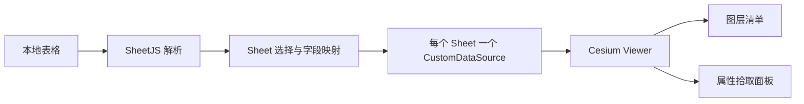

# 本地表格点图层

Feature Name: table-points
Updated: 2026-08-23

## Description

案例在浏览器端使用 SheetJS 读取本地表格的全部可用工作表。每个 Sheet 保存独立的经度、纬度和标注字段配置，用户选择一个或多个 Sheet 后，每个 Sheet 转换为一个 Cesium `CustomDataSource` 点图层。点实体通过 `PropertyBag` 保留完整属性，同一图层复用一种随机颜色，不同图层使用不同随机颜色。

## Architecture

## Components and Interfaces

- `src/cases/table-points/TablePointsDemo.vue`：文件读取、按 Sheet 字段选择、点实体、图层控制和属性拾取。
- `src/cases/table-points/index.ts`：案例元数据。
- `xlsx`：浏览器端表格解析。

## Correctness Properties

- 只有经纬度均为有限值且处于有效范围的记录创建点实体。
- 每个点实体保留原始表格字段集合。
- 图层显隐状态与对应 `CustomDataSource.show` 保持一致。
- 图层移除后不再参与 Viewer 渲染。
- 同一图层中的所有点使用相同颜色，所选不同图层使用不同颜色。

## Error Handling

文件解析失败、表格为空、坐标字段缺失和坐标无效时，案例在控制面板显示错误信息。

## Test Strategy

- 使用 `npm run build` 验证 SheetJS、Vue 模板和 Cesium 类型。
- 浏览器中加载 CSV 与 XLSX，检查字段映射、图层操作和属性拾取。
