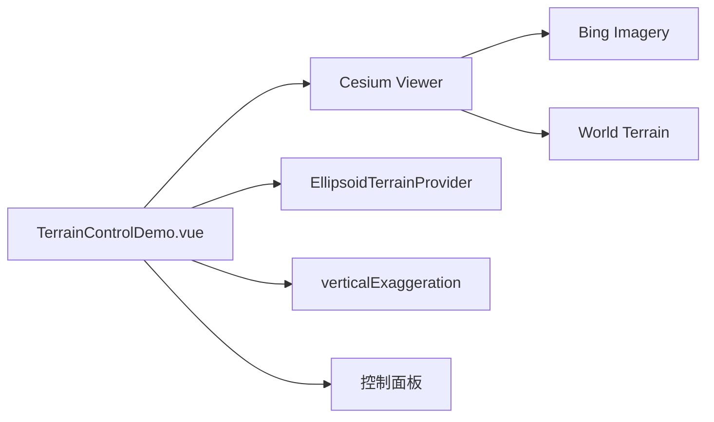

# 地形显示与夸张案例

Feature Name: terrain-control
Updated: 2026-08-23

## Description

新增独立 Vue 案例，使用 Cesium Ion World Terrain 渲染真实地形。案例通过切换 `WorldTerrain` 与 `EllipsoidTerrainProvider` 控制地形显示，通过 `Scene.verticalExaggeration` 控制高程夸张比例。

## Architecture

## Components and Interfaces

- `src/cases/terrain-control/TerrainControlDemo.vue`：Viewer、异步地形、地形切换和控制面板。
- `src/cases/terrain-control/index.ts`：案例元数据。
- 地形开关：`viewer.terrainProvider` 在 World Terrain 与椭球地形之间切换。
- 夸张控制：`viewer.scene.verticalExaggeration`。

## Correctness Properties

- 地形隐藏时影像图层保持显示。
- 高程夸张值保持在 `1` 至 `5` 范围。
- 案例卸载后 Viewer 被销毁，异步地形结果不会写入已销毁 Viewer。

## Error Handling

地形加载期间显示加载状态；加载失败时显示错误信息。

## Test Strategy

- 使用 `npm run build` 验证 TypeScript、Vue 模板和 Vite 构建。
- 通过开发服务器请求案例模块，确认模块响应正常。
- 在浏览器预览中检查地形显示开关和夸张滑杆。

## References

- [Cesium World Terrain](https://cesium.com/learn/cesiumjs-learn/terrain/)
