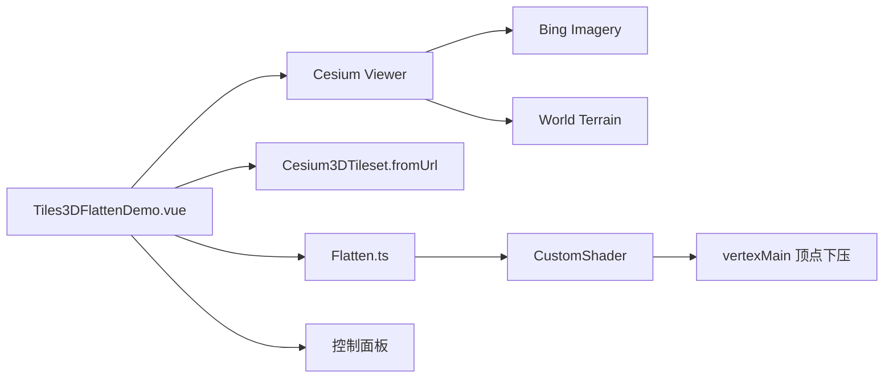

# 3DTiles 模型压平案例

Feature Name: tiles-3d-flatten
Updated: 2026-08-26

## Description

独立 Vue 案例，加载远程 3DTiles 倾斜摄影服务，并使用移植自 SDK 的 `Flatten` 类（基于 `CustomShader`）对指定 ECEF 矩形区域进行压平。压平高度默认 -50 米，可通过开关开启/恢复。

## Architecture

## Components and Interfaces

- `src/cases/tiles-3d-flatten/Tiles3DFlattenDemo.vue`：Viewer、瓦片集加载、压平开关与生命周期。
- `src/cases/tiles-3d-flatten/Flatten.ts`：移植 SDK 的压平类，基于 `CustomShader` 将矩形区域顶点沿高度方向下压。
- `src/cases/tiles-3d-flatten/index.ts`：案例元数据。
- `src/cases/tiles-3d-flatten/icon.webp`：案例卡片图标（1236×655）。
- 数据源：`app.larkview.cn/lkstationfile` 会昌倾斜摄影 tileset，`offsetHeight` 555。
- 压平区域：参考项目原 4 个 ECEF 坐标顶点；压平高度 -50 米。

## Correctness Properties

- 压平开关开启时创建 `Flatten` 实例并添加区域，关闭时 `destroy()` 恢复。
- 模型加载完成后 `statusMessage` 置空并 `zoomTo` 定位。
- 案例卸载后移除瓦片集、销毁 Flatten 与 Viewer。
- 地形加载配置与「地形效果-显示与夸张」案例一致。

## Error Handling

加载远程服务失败或地形加载失败时显示错误信息；卸载时 `disposed` 保护避免写入已销毁 Viewer。

## Test Strategy

- 使用 `npm run build` 验证 TypeScript、Vue 模板和 Vite 构建。
- 无头浏览器打开案例，检查场景中 `Cesium3DTileset` 数量为 1、压平开关切换后帧继续推进、无 error panel。

## References

- [CustomShader Guide](https://cesium.com/learn/cesiumjs-learn/cesiumjs-custom-shaders/)
