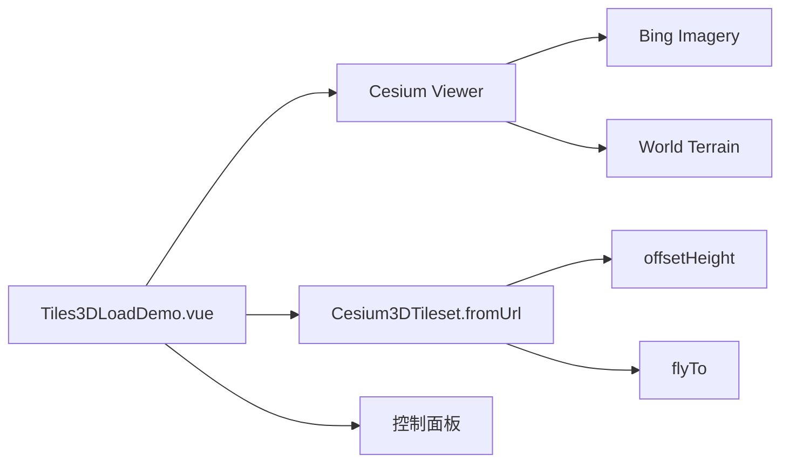

# 3DTiles 加载案例

Feature Name: tiles-3d-load
Updated: 2026-08-26

## Description

独立 Vue 案例，使用 `Cesium3DTileset.fromUrl` 加载远程 3DTiles 倾斜摄影服务。案例提供模型显示、阴影光源、监视器三个开关，并在瓦片加载后清理显存、修正模型高度后定位相机。

## Architecture

## Components and Interfaces

- `src/cases/tiles-3d-load/Tiles3DLoadDemo.vue`：Viewer、瓦片集加载、控制面板。
- `src/cases/tiles-3d-load/index.ts`：案例元数据。
- `src/cases/tiles-3d-load/icon.webp`：案例卡片图标（1236×655）。
- 数据源：`app.larkview.cn/lkstationfile` 会昌倾斜摄影 tileset（默认 URL，`offsetHeight` 555）。
- 显存控制：`tileLoad` 事件中调用 `tileset.trimLoadedTiles()`。
- 开关：模型显示（添加/移除瓦片集）、阴影光源（`globe.enableLighting` + `scene.shadowMap.enabled` + 固定 `DirectionalLight`）、监视器（直接实例化 `Cesium3DTilesInspector`，容器 `tiles-inspector-container` 定位到页面左侧，关闭时 `destroy()` 并移除容器）。

## Correctness Properties

- 模型加载完成后 `statusMessage` 置空并 `flyTo` 定位。
- 案例卸载后移除瓦片集、销毁监视器并销毁 Viewer。
- 地形加载配置与「地形效果-显示与夸张」案例一致（`depthTestAgainstTerrain`、`maximumScreenSpaceError=2`）。
- 阴影开启后光源为固定方向 `DirectionalLight`，关闭后还原 `SunLight`，保证阴影效果不受当前时钟时间影响。

## Error Handling

加载远程服务失败或地形加载失败时显示错误信息；卸载时 `disposed` 保护避免写入已销毁 Viewer。

## Test Strategy

- 使用 `npm run build` 验证 TypeScript、Vue 模板和 Vite 构建。
- 无头浏览器打开案例，检查场景中 `Cesium3DTileset` 数量为 1、无 error panel、帧推进正常。

## References

- [3D Tiles Specification](https://github.com/CesiumGS/3d-tiles)
