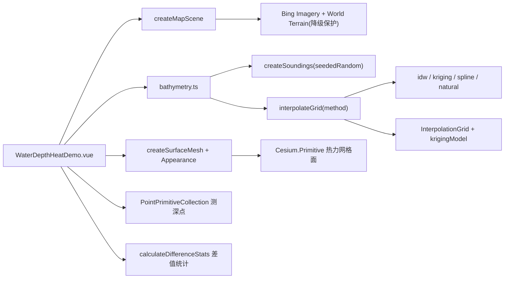

# 三维水深热力案例

Feature Name: water-depth-heat
Updated: 2026-08-26

## Description

在目标海域（上海杭州湾，CENTER 121.92/30.72，EXTENT 121.76/30.58~122.08/30.86）生成模拟测深点，通过 IDW / 普通克里金 / 薄板样条 / 自然邻域四种插值方法构建连续水深网格，以三维热力网格面（逐顶点颜色 attribute + 自定义 Appearance）与测深点渲染，支持差值对比（蓝白红发散色带 + MAE/RMSE/maxAbs 统计）与多色带映射。纯算法层抽离为无 Cesium 依赖的 `bathymetry.ts`，可独立单测。移植自用户上传参考 HTML（`fcba5efe-三维水深热力图-2.html`）。

## Architecture

## Components and Interfaces

- `src/cases/water-depth-heat/bathymetry.ts`（纯算法，无 Cesium 依赖）：
  - 类型：`Sounding`、`DepthCell`、`GridBounds`、`InterpolationGrid`、`VariogramModel`、`PaletteStop`、`ColorPalette`、`InterpolationContext`、`InterpolationOptions`、`InterpolationMethod`。
  - `CENTER` / `EXTENT` 常量；`seededRandom(seed)` 固定随机；`createSoundings(count)` 合成测深场（海沟 trench / 浅滩 bank / 通航水道 navigationChannel / 冲刷坑 scourHole / 波纹 ripples，92km 与 111km 比例波长）。
  - `interpolateIdw`（power 2.15、limit 80）；`fitVariogramModel`（maxLag 14500、binCount 12、maxPairs 18000、nuggetRatio 0.02，三模型型+五倍率+60 range 步进最小二乘拟合，输出 range/sill/nugget/maxLag/observed/type）；`interpolateKriging`（limit 22，23×23 线性系统，`solveLinearSystem` 高斯消元，求解失败回退 IDW）；`interpolateSpline`（thinPlate `(r/1000)²·ln(r/1000)`，样本 32、正则 0.02，线性系统含 zero-mean 约束）；`interpolateNaturalNeighbor`（limit 14、expansion 1.08，Delaunay 三角网 + Voronoi 面积权重）。
  - `interpolateGrid(points, method, resolution, options)` → `InterpolationGrid`：cells（west/south/east/north/depth，`marginRatio=0.04` 外扩）、bounds、min/max、krigingModel 缓存（克里金拟合仅一次，非每 cell）。
  - 色带：`colorPalettes`（ocean / thermal / channel / safety，stops `[0..1, RGB]`）、`depthToColor(depth, min, max, palette, reverse)`、`paletteToGradient(palette, reverse)`。
  - `calculateDifferenceStats(cur, base)` → `{ mae, rmse, maxAbs }`。
- `src/cases/water-depth-heat/WaterDepthHeatDemo.vue`：
  - 场景：`createMapScene` + `loadBingImagery` + `loadWorldTerrain`（catch 降级 + `disposed` 保护）；`globe.depthTestAgainstTerrain = false`；相机 flyTo `(CENTER.lon, CENTER.lat, 26000)`，heading 16° / pitch -48°。
  - 渲染：测深点 `PointPrimitiveCollection`（pixelSize 5、`disableDepthTestDistance=Infinity`、色带着色）；插值面 `interpolateGrid` cells 三角化——`createSurfaceMesh` 构建逐顶点 `color` attribute（`UNSIGNED_BYTE` + `normalize:true`），`createSurfaceAppearance` 自定义 Appearance（`depthTest.enabled=false` + `cull.enabled=false` + `ALPHA_BLEND` + 顶点着色器 `czm_translateRelativeToEye` + 片元 `out_FragColor`），`Cesium.Primitive`（`asynchronous:false`）。
  - 差值图：色带改为蓝白红发散色带（中心 [245,248,250]，负向 [45,124,181]，正向 [211,77,69]），图例显示 ±maxAbs；隐藏测点。
  - 右侧浮动面板（`.bathy-panel`，与项目其他案例一致）：插值方法 select + 方法参数滑块（idw 幂次/邻近；克里金拟合滞后 km/样本/块金；样条样本/正则；自然邻域候选/扩展）、分析参数（采样点 800~5200、网格密度 20~58、下凹倍率 20~95、透明度 20~95%）、显示点位/插值面开关、差值对比（基准方法 + 差值图开关 + 统计文本）、水深色带 + 反转 + 渐变图例、指标网格（测深点/网格单元/最浅/最深）、重新分析按钮、加载遮罩（loader-ring）。
  - `rebuildSurface` 统一重建：`interpolateGrid` 生成 grid，差值开启时额外插值基准网格 + `calculateDifferenceStats`，更新指标/图例/差值文本后重绘。
- `src/cases/water-depth-heat/index.ts`：`effects` 分类，标题「数据分析-三维水深热力」，tag「插值分析」，icon 为案例目录 `icon.webp`（用户上传截图）。
- `src/cases/index.ts`：注册 `waterDepthHeatCase`（dynamic-volume-water 之后）。

## Correctness Properties

- 网格几何：`vertexResolution = resolution + 1`，每 cell 两个三角形（SW-SE-NE、SW-NE-NW）；`sampleGridDepth` 双线性采样 cell 深度（x/y 夹取 0..1 映射 cell 坐标）；`boundingSphere.fromVertices` 构建。
- 克里金拟合只做一次（存入 `InterpolationGrid.krigingModel`），避免每 cell 全量拟合（38×38 网格性能关键）。
- 差值统计在网格重建时同步计算；当前方法与基准相同则提示差值为 0，不重复插值（直接复用自身网格）。
- 测深点与差值图互斥：差值图开启时隐藏测深点。
- 自然邻域权重非负且归一化；`interpolateKriging` 求解失败回退 IDW 保证数值稳定。
- `GeometryAttributes` 用无参构造 + 逐属性赋值（Cesium 1.144 构造函数不接受对象参数）。

## Error Handling

- `loadWorldTerrain` 失败：catch 降级，仍初始化场景（沿用 V3.59 约定）。
- 地图初始化失败：`status-mask` 显示错误信息。
- 组件卸载：`disposed = true` 保护异步回调；移除表面/点 Primitive；`destroyScene(viewer)`。

## Verification Plan

- `npm run build`（vue-tsc + vite）通过。
- 无头浏览器（Playwright + swiftshader）：
  - 进入案例零 pageerror / console error；遮罩消失；面板标题正确。
  - 指标：网格单元 = 1,444（38×38）、水深范围约 -16 ~ -47 m；中心区域高饱和彩色像素占比高（热力面真实渲染）。
  - 切换四种插值方法均重建网格（帧间像素差异 > 0）；差值图开启显示「MAE/RMSE/最大差」统计且与参考实现量级一致。
  - 切换 thermal 色带后暖色像素比例上升；反转、显隐开关不报错。
