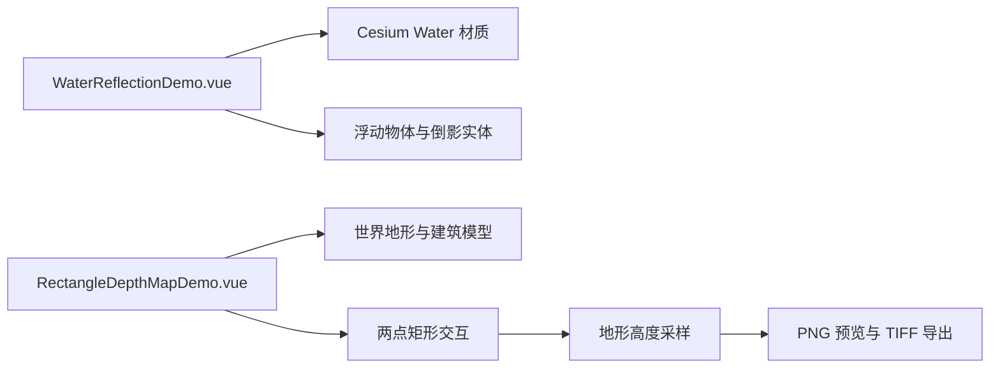

# 动态水面倒影与矩形范围深度图

Feature Name: water-reflection-depth-map
Updated: 2026-08-25

## Description

本迭代包含两个独立案例。水面案例开启 Cesium 时钟动画，默认使用参考示例的丽江水域轮廓、水面高度 1480 米、中心球体及浮动立方体位置。Cesium 内置 Water 材质承载波纹、反射、扭曲、水位、光照和色彩参数；倒影由一组在水面上随波纹、时间和物体移动而偏移、明暗变化的反射条表现。深度图案例使用世界地形、三维建筑实体、带端点标记的两点矩形框选、分批 `sampleTerrainMostDetailed` 采样和浏览器端 TIFF 编码完成导出。

## Architecture

## Components and Interfaces

- `src/cases/water-reflection/WaterReflectionDemo.vue`：管理参考丽江水域、水面高度、`clock.shouldAnimate`、中心球体、浮动立方体、波纹反射条、参数和边界输入。
- `src/cases/rectangle-depth-map/RectangleDepthMapDemo.vue`：管理地形场景、起点与终点标记、实时矩形、分批采样进度、预览、PNG 下载和 TIFF 下载。
- `src/cases/index.ts`：注册两个案例入口。
- TIFF 文件采用单通道 8 位、无压缩的基线 TIFF 数据布局。

## Correctness Properties

- 水面与倒影开关分别控制目标图元可见性。
- 默认水面覆盖参考示例使用的丽江水域轮廓，水面高度默认为 1480 米。
- 每条倒影条根据时钟、波纹幅度、扭曲强度和浮动物体位置生成独立偏移及透明度。
- 中心球体与浮动立方体以响应式大小和高度参数驱动，高度滑块范围为 10 至 1500 米；浮动立方体的倒影条继承物体大小和水位高度基准。
- 水面多边形保留顶点高程，相机从当前边界计算并添加边距后定位；反射条加宽、加高并使用基于反射率的最低可见透明度。
- 新增独立 `WaterReflectionPrimitive`：镜像主相机、将场景渲染到帧缓冲纹理，并由自定义 GLSL 水面材质按法线扰动采样该纹理；该案例复用参考实现的公共参数与丽江水域场景。
- 反射材质使用占位纹理初始化 `image` 与 `normalTexture` 采样器，法线贴图异步加载后替换，避免采样器为空导致运行时错误。
- 自定义顶点着色器必须输出默认 `MaterialAppearance` 片元模板（Textured 外观）所需的 `v_positionEC`、`v_normalEC`、`v_st` 三个 varying，片元部分由外观模板与材质 `czm_getMaterial` 源码拼接；缺失这些 varying 会导致 GLSL 链接失败，场景渲染中断。
- 自定义顶点着色器必须声明 `in float batchId;`：Cesium 的 `createShaderProgram` 无条件注入 `czm_batchTable_pickColor(batchId)`，缺少声明会触发 `'batchId' : undeclared identifier` 编译错误。
- 离屏反射渲染禁止嵌套 `scene.render()`（每帧约 1000fps 的重入渲染会阻塞主线程）；改为按参考实现手动渲染：`scene.updateFrameState()` + 设置 `frameState.passes.render` 与 `Cesium3DTilePassState` + `updateEnvironment()` + `updateAndExecuteCommands(passState, backgroundColor)` + `resolveFramebuffers(passState)`，将场景直接渲染进反射帧缓冲。
- 帧缓冲纹理所有权：`colorTexture`（`image` uniform）与 `normalTexture` 交由 `Material` 管理（`Material.update` 替换 uniform 值时自动销毁旧纹理，`material.destroy()` 销毁全部缓存纹理）；`framebuffer` 构造时设置 `destroyAttachments: false` 避免连带销毁附件；`depthTexture` 由图元手动销毁。禁止先手动销毁纹理再销毁 framebuffer，否则触发双重销毁 `DeveloperError`。
- 有效水面边界至少包含三个有限经纬度坐标。
- 深度图矩形由两个角点的经纬度最小值和最大值构成。
- 矩形预览和最终矩形显示起点与终点标记，最终矩形填充透明度为 0.3。
- 采样分批次处理，每批处理后更新生成进度，支持至多 1024 x 1024 像素。
- 预览图和 TIFF 的每个像素都来自同一组归一化地形高度。
- 卸载案例时释放 Cesium Viewer 和屏幕事件处理器。

## Error Handling

水面边界格式异常时保留当前图元并显示格式提示。地形加载、位置拾取或高程采样异常时，控制状态区域显示错误信息。

## Test Strategy

- 使用 `npm run build` 验证 Vue、TypeScript 和 Vite 构建。
- 使用 `git diff --check` 验证补丁格式。
- 在预览中检查水面和倒影开关、矩形第二个角点自动生成、预览面板与两个下载按钮。

## References

- [Arc3DLab 动态水面倒影示例](https://github.com/jianlei-wang/Arc3DLab-SDK-Pro/blob/master/demo-vue3-html/public/011-%E5%8A%A8%E6%80%81%E6%B0%B4%E9%9D%A2%EF%BC%88%E5%B8%A6%E5%80%92%E5%BD%B1%EF%BC%89.html)
- [Arc3DLab 深度图示例](https://github.com/jianlei-wang/Arc3DLab-SDK-Pro/blob/master/demo-vue3-html/public/017-%E6%B7%B1%E5%BA%A6%E5%9B%BE.html)
