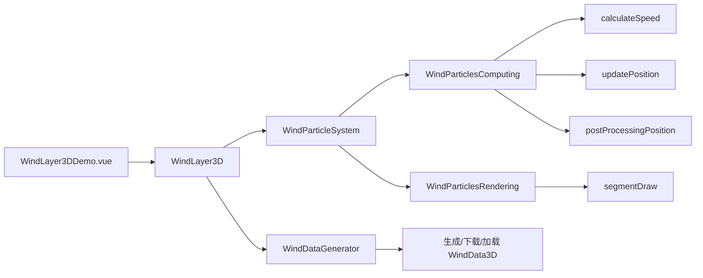

# 三维风场粒子流线案例

Feature Name: wind-layer-3d
Updated: 2026-08-23

## Description

风场案例通过 Cesium 私有渲染 API（`ComputeCommand`、`DrawCommand`、`Texture3D`）实现 GPU 粒子风场：三维风矢量以 `Texture3D` 存储，粒子位置以 `Float32` 纹理迭代，流线以自定义图元绘制并与场景深度做遮挡。参考实现为 `lby0101/cesium-wind-layer-3d`（MIT）。

## Architecture



## Components and Interfaces

- `src/cases/wind-layer-3d/WindLayer3DDemo.vue`：Viewer 生命周期、控制面板、数据加载与生成交互。
- `src/cases/wind-layer-3d/lib/windLayer3d.ts`：`WindLayer3D` 主类，管理事件、可见性与数据更新。
- `src/cases/wind-layer-3d/lib/windParticleSystem.ts`：组合计算与渲染子系统的粒子系统。
- `src/cases/wind-layer-3d/lib/windParticlesComputing.ts`：GPU 计算子系统与粒子/风纹理。
- `src/cases/wind-layer-3d/lib/windParticlesRendering.ts`：流线渲染子系统与颜色表、帧缓冲。
- `src/cases/wind-layer-3d/lib/customPrimitive.ts`：`ComputeCommand`/`DrawCommand` 封装的自定义图元。
- `src/cases/wind-layer-3d/lib/shaders/*.ts`：四个 GLSL `#version 300 es` shader 源码常量。
- `src/cases/wind-layer-3d/lib/windDataGenerator.ts`：自定义四至合成风场与 JSON 序列化/下载。
- `src/cases/wind-layer-3d/lib/cesium-render.d.ts`：Cesium 内部渲染类型补充声明。
- `src/cases/wind-layer-3d/data/wind_3d.json`：示例真实风场数据（464×374×6，约 16MB）。

## WindData3D 数据契约

```typescript
type WindData3D = {
  u: { array: Float32Array; min?: number; max?: number }
  v: { array: Float32Array; min?: number; max?: number }
  w: { array: Float32Array; min?: number; max?: number }
  speed?: { array: Float32Array; min?: number; max?: number }
  nx: number
  ny: number
  nz: number
  bounds: { west: number; south: number; east: number; north: number }
  levels: number[]
}
```

## Correctness Properties

- 粒子位置纹理初始为四至范围内的随机分布，避免首帧全部粒子从原点出发。
- `frameRate` 与 `frameRateAdjustment` 在首帧前有有效值，避免速度乘 `undefined` 产生 NaN 位置。
- 粒子越界或达到 dropRate 时重新播种，播种位置与速度相关，保证粒子持续可见。
- 渲染顶点 4 顶点构成 2 三角形线段，顶点 `normal` 属性编码线段端点（-1/1）与两侧偏移符号。
- 流线片段与场景 `czm_globeDepthTexture` 深度比较，地形遮挡正确。
- 计算命令设置 `persists: true`，保证纹理在帧间持久。
- 案例卸载时释放全部纹理、帧缓冲、计算/绘制命令、帧率监视器与事件监听。

## Error Handling

- WindData3D JSON 加载失败时显示失败提示，保留重试入口。
- 生成风场时对输入四至、网格与层级做合法性校验并给出提示。

## Test Strategy

- 使用 `npm run build` 验证 TypeScript、Vue 模板和 Vite 构建。
- 通过开发服务器请求案例模块，确认 HMR 响应正常。
- 浏览器预览中验证真实数据加载、自定义四至生成、下载与加载、粒子/速度/线长/高度/动态控制、缩放与遮挡效果。

## References

- 开源仓库 `https://github.com/lby0101/cesium-wind-layer-3d`（MIT License）
